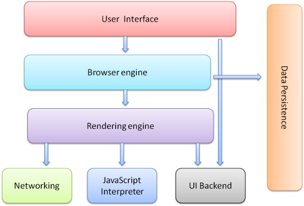

## 요약

브라우저의 주요 기능은 사용자가 원하는 웹페이지를 서버에 요청(Request)하고 서버의 응답(Reponse)을 받아 브라우저에 표시하는 것입니다.  
브라우저는 HTML, CSS 명세에 따라 HTML파일을 해석해서 보여줍니다.  

이 명세는 웹 표준화 기구인 W3C(World Wide Web Consortium)에서 정합니다. 

## 깊게 들어가기

### 브라우저의 기본 구조



* 유저 인터페이스 : 이전, 다음, 새로고침, 북마크 같이 요청한 페이지는 보여주는 부분 외에 유저에게 동일하게 보이는 부분입니다.
* 브라우저 엔진 : 유저 인터페이스와 렌더링 엔진 사이에 쿼리를 전달할 수 있게 조작을 담당합니다.
* 렌더링 엔진 :  사용가자가 요청한 페이지는 화면에 표시하기 위해 HTML과 CSS를 파싱/해석합니다.
* 네트워킹 : http 요청을 할 수 있고, 네트워크 호출에 사용됩니다.
* 자바스크립트 해석기 : Javascript Code를 해석 및 실행합니다.
* UI 벡엔드 : 기본적인 UI들 예로 input, select 같은 위젯을 그리는 인터페이스입니다.
* 자료 저장소 : 쿠키같은 지원들을 저장하는 영역입니다.

### 렌더링 엔진

파이어폭스는 모질라에서 직접 만든 게코(Gecko) 엔진을 사용, 사파리와 크롬은 웹킷(Webkit) 엔진(오픈소스 엔진)을 사용합니다.


HTML를 돔 트리로 파싱 -> 렌더 트리 구축 -> 렌더 트리 배치 -> 렌더 트리 그리기

**동작 과정**


HTML, CSS 각각의 파서가 있고 HTML은 각 태그들로 DOM트리를 구성, CSS도 스타일 규칙에 맞게 파싱된 후 같이 '렌더 트리'를 생성합니다.  
그 후에 배치가 시작되는데 이것은 각 노드가 화면의 정확한 위치에 표시되는 것을 의미합니다.   
그리기 과정을 시작됩니다. 

모든 내용을 한 번에 파싱될 후 보여주기엔 속도가 느릴 수 있기 때문에 기다리지 않고 파싱과 배치가 이뤄집니다.

네트워크로부터 나머지 내용이 전송되기를 기다리는 동시에 받은 내용의 일부를 먼저 화면에 표시합니다.  

### 파싱과 DOM 트리 구축

문서 파싱은 브라우저가 코드를 이해하고 사용할 수 있는 구조로 변환하는 것을 의미합니다.  
파싱 결과는 보통 문서 구조를 나타내는 노드 트리인데 파싱 트리(parse tree) 또는 문법 트리(syntax tree)라고 부릅니다.  

**HTML 파싱**

HTML 파서는 HTML 마크업을 파싱 트리로 변환합니다.  
XML에 반하여 HTML은 "유연한" 문법입니다.  
DOM은 문서 객체 모델(Document Object Model)의 준말입니다.  
DOM은 마크업과 1:1의 관계를 맺습니다.  

```html
<html>
  <body>
    <p> Hello World </p>
    <div>
      
    </div>
  </body>
</html>
```


**CSS 파싱**

HTML과는 다르게 CSS는 문맥 자유 문법입니다.  
CSS 파일은 스타일 시트 객체로 파싱되고 각 객체는 CSS 규칙을 포함합니다.  


### 스크립트와 스타일 시트의 진행 순서

**스크립트**

스크립트가 실행되는 동안 문서의 파싱은 중단됩니다.  
스크립트가 외부에 있는 경우 우선 네트워크로부터 자원을 받을 때까지 파싱은 중단됩니다.  
스크립트를 "지연(defer)"으로 표시하게 되면 문서 파싱은 중단되지 않고 문서 파싱이 완료된 이후에 스크립트가 실행됩니다.  
HTML5는 스크립트를 비동기(asynchronous)로 처리하는 속성을 추가했기 때문에 별도의 맥락에 의해 파싱되고 실행됩니다.  
 
**예측 파싱**

웹킷과 파이어폭스는 예측 파싱과 같은 최적화를 지원합니다.  
스크립트를 실행하는 동안 다른 스레드는 네트워크로부터 다른 자원을 찾아 내려받고 문서의 나머지 부분을 파싱합니다.  

이런 방법은 자원을 병렬로 연결하여 받을 수 있고 전체적인 속도를 개선합니다.  
예측 파서는 외부 스크립트, 외부 스타일 시트와 외부 이미지와 같이 참조된 외부 자원을 파싱할 뿐입니다.  
 
**스타일 시트**

스타일 시트는 DOM 트리를 변경하지 않기 때문에 문서 파싱을 기다리거나 중단할 이유가 없습니다.  

그러나 스크립트가 문서를 파싱하는 동안 스타일 정보를 요청하는 경우라면 문제가 됩니다.  
스타일이 파싱되지 않은 상태라면 스크립트는 잘못된 결과를 내놓기 때문에 많은 문제를 야기합니다.  

파이어폭스는 아직 로드 중이거나 파싱 중인 스타일 시트가 있는 경우 모든 스크립트의 실행을 중단합니다.  
한편 웹킷은 로드되지 않은 스타일 시트 가운데 문제가 될만한 속성이 있을 때에만 스크립트를 중단합니다.  

## 참고

* [브라우저 동작 원리 알아보기](https://jaddong.tistory.com/entry/브라우저-동작-원리-알아보기)