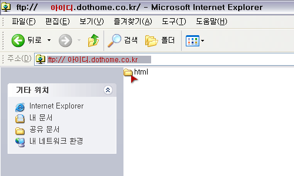
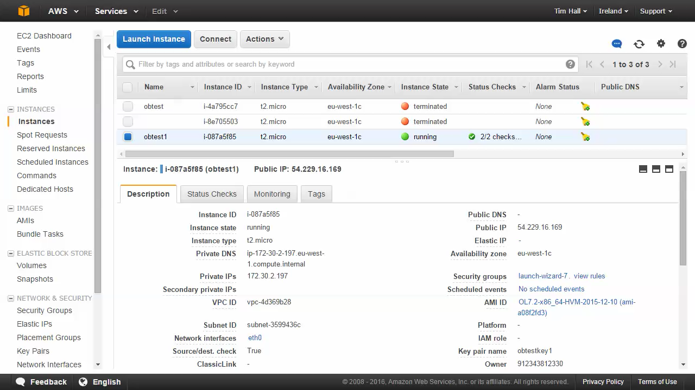

## 요약

호스팅이란 정보의 집약체인 서버의 전체 혹은 일부를 이용할 수 있도록 임대해 주는 서비스를 말합니다.  

서버를 관리하기 위해서는 24시간 내내 안정적으로 전기를 공급해야 하고, 빠르고 안정적인 인터넷 회선을 사용해야 하며, 철저한 보안 시스템을 갖추고 있어야 합니다. 

따라서 개인이 서버를 관리하기 보단 전문 업체의 호스팅 서비스를 사용하는 것이 일반적입니다.

## 깊게 들어가기

### 호스팅의 종류

**웹 호스팅**

웹 호스팅은 여러 고객이 하나의 서버를 함께 사용하는 형태입니다.  
하나의 서버를 나누어 쓰기 때문에 저렴하게 이용할 수 있고, 호스팅 업체의 통합 관리를 받기에 편리합니다.  
그러나 사용할 수 있는 하드웨어가 제한적이라는 단점도 있습니다.

**서버 호스팅**

서버 호스팅은 고객이 단독 서버를 사용하는 형태입니다.  
넓은 하드웨어 공간을 사용할 수 있고, 서버 운영/관리에 대한 직접적인 권한을 가질 수 있습니다.  
또한, 빠른 데이터 전송 속도도 누릴 수 있습니다. 

하지만 단독으로 서버를 이용하는 만큼 비용이 높은 편입니다. 
대기업이나 대형 포탈 혹은 대형 오픈마켓과 같이 많은 데이터를 사용하는 기업들이 사용하기 좋습니다.

> IDC - [https://dany-it.tistory.com/172](https://dany-it.tistory.com/172)

**클라우드 서버**

서버 호스팅을 가상화한 것으로, 가상 서버를 단독으로 사용할 수 있는 형태입니다.  
고객이 필요할 때마다 서버 자원을 늘리거나 축소하여 유연하게 서버를 이용할 수 있습니다.  
하지만 하나의 가상 서버에 문제가 생기면 연결된 다른 가상 서버에도 문제가 생길 수 있다는 단점이 있습니다.

대표적으로 AWS, Azure, Oracle Cloud가 있습니다

## 참고

* [호스팅은 무엇일까요](https://velog.io/@sejong202/호스팅은-무엇일까요)