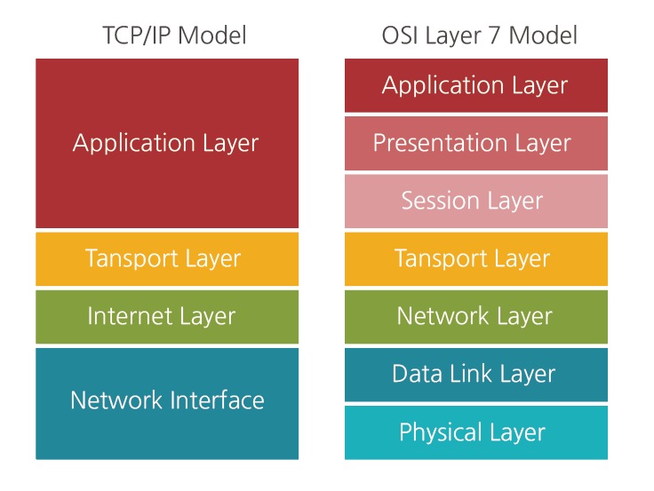
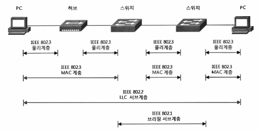
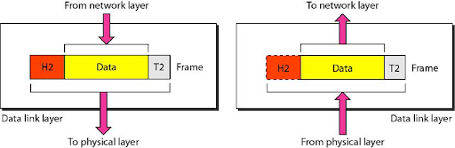
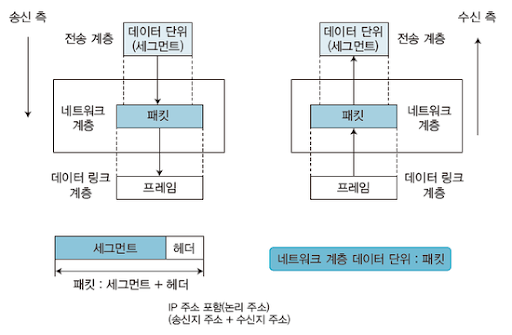
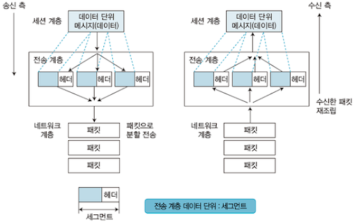

## 요약

**OSI 모형**(Open Systems Interconnection Reference Model)은 국제표준화기구(ISO)에서 개발한 모델로, 컴퓨터 네트워크 프로토콜 디자인과 통신을 계층으로 나누어 설명한 것입니다. 

일반적으로 **OSI 7 계층이라고 합니다.**

## 깊게 들어가기

### 역사

1970년대 말에, 한 프로젝트가 국제 표준화 기구(ISO)에 의해 관리되고 있었고 다른 하나는 국제 전신 자문 위원회(International Telegraph and Telephone Consultative Committee)에 의해 관리되었습니다. 이 두 개의 국제 표준 기구들은 각각 비슷한 네트워킹 모델을 정의해놓은 문서를 만들었습니다.

1983년에 이 두 문서들은 개방형 시스템 상호 연결을 위한 기초 참조 모델(The Basic Reference Model for Open Systems Interconnection)이라는 이름의 표준을 만들기 위해 병합되었습니다. 이 표준은 보통 OSI 참조 모델(Open Systems Interconnection Reference Model)로 불렸다. 1984년에 ISO가 표준 ISO 7498라는 이름으로 출판하였고, CCITT(현재의 ITU-T)는 표준 X.200으로 출판하였습니다.

OSI는 기초 참조 모델로 불리는 추상형 네트워킹 모델(abstract model of networking), 그리고 특정한 프로토콜들의 집합, 이렇게 2가지 주된 구성 요소가 있습니다.

7계층 모델의 개념은 허니웰 인포메이션 서비스(Honeywell Information Services)의 찰스 바크만의 노고에 의해서 탄생하였습니다. 다양한 관점의 OSI 디자인은 ARPANET, NPLNET, EIN, CYCLADES 네트워크, 그리고 IFIP 2G6.1의 작업의 경험에서 발전하였습니다. 새로운 디자인이 ISO 7498 및 여러 부록을 통해 문서화되었습니다. 이 모델에서 네트워킹 시스템은 여러 계층으로 분리되었습니다. 각 레이어마다 하나 이상의 엔티티가 기능을 구현하고 있습니다. 각 엔티티는 자신 아래의 계층과만 통신하며 위의 계층에서 사용할 수 있는 기능을 제공하였습니다.

OSI 표준 문서는 X.200 시리즈의 권고안으로서 ITU-T를 통해 참조가 가능합니다. 프로토콜 사양 중 일부는 ITU-T X 시리즈의 일부로 참조할 수 있습니다. OSI 모형에 대한 동등한 ISO 및 ISO/IEC 표준은 ISO를 통해 이용이 가능합니다. 모두 무료인 것은 아닙니다.

### 목적

이 모델은 프로토콜을 기능별로 나눈 것입니다.  

각 계층은 하위 계층의 기능만을 이용하고, 상위 계층에게 기능을 제공합니다.  
'프로토콜 스택' 혹은 '스택'은 이러한 계층들로 구성되는 프로토콜 시스템이 구현된 시스템을 가리키는데, 프로토콜 스택은 하드웨어나 소프트웨어 혹은 둘의 혼합으로 구현될 수 있습니다. 일반적으로 하위 계층들은 하드웨어로, 상위 계층들은 소프트웨어로 구현됩니다.

### 계층 기능

**계층 1: 물리 계층**

물리 계층(Physical layer)은 네트워크의 기본 네트워크 하드웨어 전송 기술을 이룹니다.  
네트워크의 높은 수준의 기능의 논리 데이터 구조를 기초로 하는 필수 계층입니다.  
다양한 특징의 하드웨어 기술이 접목되어 있기에 OSI 아키텍처에서 가장 복잡한 계층으로 간주됩니다.

**계층 2: 데이터 링크 계층**

데이터 링크 계층(Data link layer)은 포인트 투 포인트(Point to Point) 간 신뢰성있는 전송을 보장하기 위한 계층으로 CRC 기반의 오류 제어와 흐름 제어가 필요합니다.  
네트워크 위의 개체들 간 데이터를 전달하고, 물리 계층에서 발생할 수 있는 오류를 찾아 내고, 수정하는 데 필요한 기능적, 절차적 수단을 제공합니다.  
주소 값은 물리적으로 할당 받는데, 이는 네트워크 카드가 만들어질 때부터 맥 주소(MAC address)가 정해져 있습니다는 뜻입니다.  

주소 체계는 계층이 없는 단일 구조입니다.  
데이터 링크 계층의 가장 잘 알려진 예는 이더넷입니다.  
이 외에도 HDLC나 ADCCP 같은 포인트 투 포인트(point-to-point) 프로토콜이나 패킷 스위칭 네트워크나 LLC, ALOHA 같은 근거리 네트워크용 프로토콜이 있습니다. 

네트워크 브릿지나 스위치 등이 이 계층에서 동작하며, 직접 이어진 곳에만 연결할 수 있습니다.

* 프레임에 주소부여(MAC - 물리적주소)
* 에러검출/재전송/흐름제어

**계층 3: 네트워크 계층**

네트워크 계층(Network layer)은 여러개의 노드를 거칠때마다 경로를 찾아주는 역할을 하는 계층으로 다양한 길이의 데이터를 네트워크들을 통해 전달하고, 그 과정에서 전송 계층이 요구하는 서비스 품질(QoS)을 제공하기 위한 기능적, 절차적 수단을 제공합니다.  

네트워크 계층은 라우팅, 흐름 제어, 세그멘테이션(segmentation/desegmentation), 오류 제어, 인터네트워킹(Internetworking) 등을 수행합니다. 

라우터가 이 계층에서 동작하고 이 계층에서 동작하는 스위치도 있습니다.  
데이터를 연결하는 다른 네트워크를 통해 전달함으로써 인터넷이 가능하게 만드는 계층입니다.  
논리적인 주소 구조(IP), 곧 네트워크 관리자가 직접 주소를 할당하는 구조를 가지며, 계층적(hierarchical)입니다.

서브네트의 최상위 계층으로 경로를 설정하고, 청구 정보를 관리합니다.  
개방형 시스템들의 사이에서 네트워크 연결을 설정, 유지, 해제하는 기능을 부여하고, 전송 계층 사이에 네트워크 서비스 데이터 유닛(NSDU : Network Service Data Unit)을 교환하는 기능을 제공합니다.

* 주소부여(IP)
* 경로설정(Route)

**계층 4: 전송 계층**

전송 계층(Transport layer)은 양 끝단(End to end)의 사용자들이 신뢰성있는 데이터를 주고 받을 수 있도록 해 주어, 상위 계층들이 데이터 전달의 유효성이나 효율성을 생각하지 않도록 해줍니다. 시퀀스 넘버 기반의 오류 제어 방식을 사용합니다.  

전송 계층은 특정 연결의 유효성을 제어하고, 일부 프로토콜은 상태 개념이 있고(stateful), 연결 기반(connection oriented)입니다. 이는 전송 계층이 패킷들의 전송이 유효한지 확인하고 전송 실패한 패킷들을 다시 전송합니다는 것을 뜻합니다. 가장 잘 알려진 전송 계층의 예는 TCP입니다.

종단간(end-to-end) 통신을 다루는 최하위 계층으로 종단간 신뢰성 있고 효율적인 데이터를 전송하며, 기능은 오류검출 및 복구와 흐름제어, 중복검사 등을 수행합니다.

* 패킷 생성(Assembly/Sequencing/Deassembly/Error detection/Request repeat/Flow control)

**계층 5: 세션 계층**

세션 계층(Session layer)은 양 끝단의 응용 프로세스가 통신을 관리하기 위한 방법을 제공합니다.  
동시 송수신 방식(duplex), 반이중 방식(half-duplex), 전이중 방식(Full Duplex)의 통신과 함께, 체크 포인팅과 유휴, 종료, 다시 시작 과정 등을 수행합니다.  
이 계층은 TCP/IP 세션을 만들고 없애는 책임을 집니다.

통신하는 사용자들을 동기화하고 오류복구 명령들을 일괄적으로 다룹니다.

* 통신을 하기 위한 세션을 확립/유지/중단 (운영체제가 해줌)

**계층 6: 표현 계층**

표현 계층(Presentation layer)은 코드 간의 번역을 담당하여 사용자 시스템에서 데이터의 형식상 차이를 다루는 부담을 응용 계층으로부터 덜어 줍니다.  
MIME 인코딩이나 암호화 등의 동작이 이 계층에서 이루어집니다.  
예를 들면, EBCDIC로 인코딩된 문서 파일을 ASCII로 인코딩된 파일로 바꿔 주는 것이 표현 계층의 몫입니다.

* 사용자의 명령어를 완성및 결과 표현.
* 포장/압축/암호화

**계층 7: 응용 계층**

응용 계층(Application layer)은 응용 프로세스와 직접 관계하여 일반적인 응용 서비스를 수행합니다.  
일반적인 응용 서비스는 관련된 응용 프로세스들 사이의 전환을 제공합니다.  

응용 서비스의 예로, 가상 터미널(예를 들어, 텔넷), "Job transfer and Manipulation protocol" (JTM, 표준 ISO/IEC 8832) 등이 있습니다.

* 네트워크 소프트웨어 UI 부분
* 사용자의 입출력(I/O)부분

## 참고

* [OSI 모형](https://ko.wikipedia.org/wiki/OSI_모형)
* [클라우드플레어 측 설명](https://www.cloudflare.com/ko-kr/learning/ddos/glossary/open-systems-interconnection-model-osi/)