## 요약

TDD = 테스트를 염두에 둔 프로그램 개발 방법  
단위 테스트 = Mocha (Node Module)  
테스트 커버리지 = NYC (Node Module)  

TDD가 뭐고, Mocha와 NYC를 이용해 어떻게 Typescript 코드를 TDD 할 수 있는지를 알아보도록 하겠습니다.

## 깊게 들어가기

### TDD란?

테스트 주도 개발(Test-driven development, TDD)은 매우 짧은 개발 사이클을 반복하는 소프트웨어 개발 프로세스 중 하나입니다. 

우선 개발자는 바라는 향상 또는 새로운 함수를 정의하는 (초기적 결함을 점검하는) 자동화된 테스트 케이스를 작성합니다.  

그런 후에, 그 케이스를 통과하기 위한 최소한의 양의 코드를 생성합니다.  

그리고 마지막으로 그 새 코드를 표준에 맞도록 리팩토링합니다.  

즉 “테스트를 염두에 둔 프로그램 개발 방법”입니다.


> 기존의 개발 프로세스

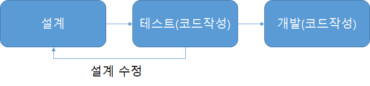

> 테스트 주도 개발 프로세스

이와 같이 그림을 통해 한눈에 차이점을 알 수 있습니다.  
테스트 코드를 작성하며 결과를 예상해볼 수 있기에 설계의 문제로 인한 오류 개선 속도가 한층 빨라질 것임을 직관적으로 알 수 있습니다.  
TDD 개발을 하면서 얻을 수 있는 큰 장점 중 하나로 보입니다.

물론 TDD가 필요해 보이긴 하지만 평소 해오던 개발 방법을 바꾸기에는 충분한 이유가 되지 않아 보입니다.  
그래서 앞으로 TDD의 장점이 정확히 무엇인지 알아보겠습니다.

**TDD(Test-driven development)의 장점은 무엇인가?**

#### **객체지향적인 코드 개발**

테스트 코드를 먼저 작성한다면 좀 더 명확한 기능과 구조를 설계할 수 있습니다.  
각각의 함수를 정의할 때 각각의 기능들에 대해서 철저히 구조화 시켜 코드를 작성할 수 있게 됩니다.  

그 이유는 테스트의 용이성을 위해 복잡한 기능을 한 함수에 모두 구현할 경우 테스트 방식이 복잡해지고 시간이 오래 걸리며 코드 수정이 되는 경우 테스트 코드를 재사용할 수 없게 되기 때문입니다.  

자연스럽게 TDD의 목적인 코드의 재사용성을 보장하며 코드를 작성하게 됩니다.

결국 TDD는 “모든 코드”가 재사용성 기반으로 작성되어야 하기 때문에 보다 기본적으로 객체지향적인 코드가 되는 것입니다.​

#### **설계 수정 시간의 단축**

앞에서 그림과 함께 설명한 것처럼 테스트 코드를 먼저 작성하기 때문에 최초 설계 안을 만족시키며 입출력 구조와 기능의 정의를 명확히 하게 되므로 설계의 구조적 문제를 바로 찾아내게 됩니다.  

실제로 테스트 코드를 작성하면서 인터페이스나 클래스의 구조들을 많이 수정하게 됩니다.  

그리고 미리 테스트 시나리오를 작성해봄으로써 코드 개발 전 기능을 구현하기 위한 예외 상황들을 미리 확인해보고 조사하게 되는 효과가 발생하여 예외 코드를 작성하기 쉬워집니다.

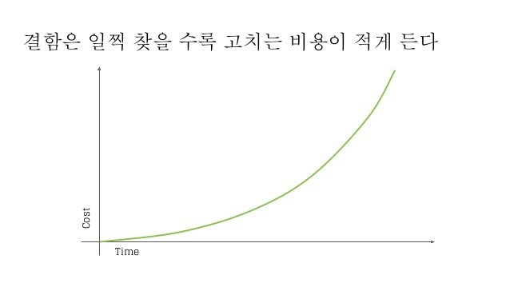

> 결함 수정 비용에 대한 예시(출처: [https://www.slideshare.net/koreakihoon/tdd-112099012](https://www.slideshare.net/koreakihoon/tdd-112099012), TDD 관련 발표 자료)

#### **디버깅 시간의 단축**

기본적으로 단위 테스트 기반의 테스트 코드를 작성하기 때문에 추후 문제가 발생하였을 때 각각의 모듈 별로 테스트를 진행해보면 문제의 지점을 쉽게 찾아낼 수 있습니다. 만약 TDD 개발이 아니라면 특정 버그를 찾기 위해서 모든 영역의 코드들을 살펴봐야 할 것입니다.  

문제가 발생할 수 있는 지점은 DB 영역, Application 영역, Data 영역, Memory 영역 등 다양하기 때문에 모든 영역을 통합 테스트하게 되면 쉽게 문제의 지점을 찾을 수 없게 됩니다.  

하지만 TDD 개발로 인해 각각의 단위 테스트를 진행하게 된다면 영역을 분할하여 쉽게 찾아낼 수 있을 것입니다.

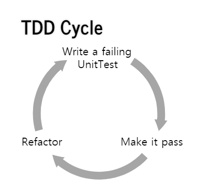

>  TDD Cycle in Unit Test(출처: [http://memee.github.io/tdd/#/7](http://memee.github.io/tdd/#/7), TDD 관련 발표 자료)

#### **유지 보수의 용이성**

대부분의 개발자는 설계 및 코드 작성 시 기술적인 관점으로 바라보게 됩니다.  
기술적인 관점이 나쁜 것은 아니지만 기능 자체의 실현에 목적을 두기 때문에 코드가 복잡해지고 테스트가 어려워집니다.  

TDD 개발로 인해 항상 그 테스트 요소들이 사용자 관점으로 정의되고 진행되기 때문에 입력과 출력의 흐름이 명확해지고 추후 구조의 변경 및 소스 수정 시 구조를 쉽게 파악하고 빠른 수정이 가능해집니다.  
더불어 재사용 테스트도 쉽게 가능해집니다.

#### **테스트 문서의 대체 가능**

대부분의 개발 프로젝트 진행 시 테스트를 진행하는 경우 단순 통합 테스트에 지나지 않습니다.  
즉, 내부적으로 개별적인 모듈들이 어떻게 테스트 되었는지 제공할 수 없습니다.  
하지만 TDD를 구현하게 될 경우에 테스팅을 자동화 시킴과 동시에 보다 정확한 테스트 근거를 산출할 수 있습니다.

이와 같이 TDD는 많은 장점을 가지고 있으며 개별적인 개발 시 테스트를 고려한 코드 작성으로 개발 시간이 늦어지는 단점이 보일 수 있으나 전체적인 개발 시간은 비슷하거나 단축되는 효과가 있습니다.  
이후 코드 수정 및 구조 추가의 용이성을 생각해본다면 기본적으로 TDD를 적용한 개발 방법이 많은 도움이 될 것이라고 보입니다.

### Mocha

#### **Mocha가 무엇인가요?**

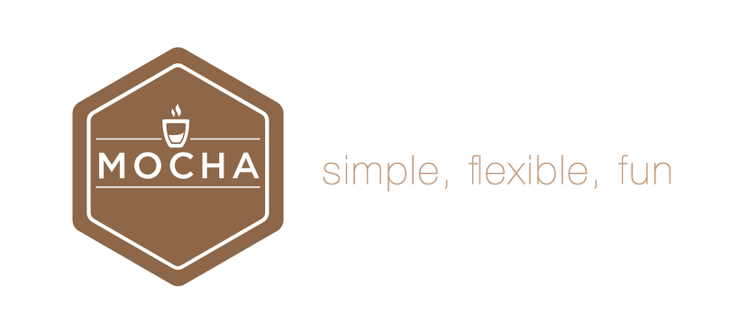


Mocha는 Node.js 테스트 프레임워크로써, Javascript 코드의 단위 테스트 기능을 제공합니다.

> Mocha말고 Jest라는 테스트 프레임워크도 존재합니다.  
> 그런데, Mocha에 비해 속도가 많이 떨어지는 등의 문제가 있어서 사용하지 않는 것을 추천합니다.  
> [Jest 탈출기 - Jest는 느리다](https://libsora.so/posts/escape-from-jest-jest-is-slow/)

#### **설치 방법**

```sh
npm i mocha --save-dev
npm i -g mocha  # 자주 사용할 예정이신 경우, Global로 설치하는 것을 추천합니다
```

#### **사용 방법**

테스트 코드를 아래를 참고하여 작성합니다.

```ts
// 테스트 블록
//    describe = context : 테스트 suite
//    it = specify : 단위테스트

// 훅 메소드
//    before() : 블록 범위 내 전체 테스트 전에 실행
//    after() : 블록 범위 내 전체 테스트 후에 실행
//    beforeEach() : 블록 범위 내 각 단위테스트 직전에 실행
//    afterEach() : 블록 범위 내 각 단위테스트 직후에 실행

// 유용한 팁
//    1. mocha의 context를 사용할 일이 있다면 화살표함수를 사용하면 안된다. this에 접근할 수 없게되기 때문이다.
//    2. 타임아웃은 개별 테스트 케이스의 describe레벨에서 this.timeout(5000); 설정. 전역적으로 하려면 mocha --timeout 5000
//    3. 특정 조건에서 런타임에 테스트를 무시하고 싶다면 this.skip(); 을 쓰자.
//        3-1. if (condition) this.skip();
//             ex. 로컬에서는 성공할수 없는 테스트이거나, 특정 os에서 동작하지 않는 코드인 경우 등
//    4. npm 스크립트 등록하고 쓰는 것을 추천 : npm test = "mocha --exit --timeout 5000 test/**/*.spec.js"
//        4-1. 내부적으로 ./node_modules/mocha 를 실행
//    5. #태그를 달고 mocha grep으로 태그가 달린 것만 테스트해볼 수도 있다. (cold-test)

describe("Test suite", function () {
    before(function () {
        console.log('전체 테스트 전에 실행');
    });

    beforeEach(function () {
        console.log('블록 범위 내 각 테스트 전에 실행');
    });

    after(function () {
        console.log('전체 테스트 후에 실행');
    });

    afterEach(function () {
        console.log('블록 범위 내 각 테스트 후에 실행');
    });

    it("should be ok", function (done) {
        setTimeout(function () {
            assert.equal(0, 0);
            done(); // 비동기 테스트 종료
        }, 1000);
    });
});
```

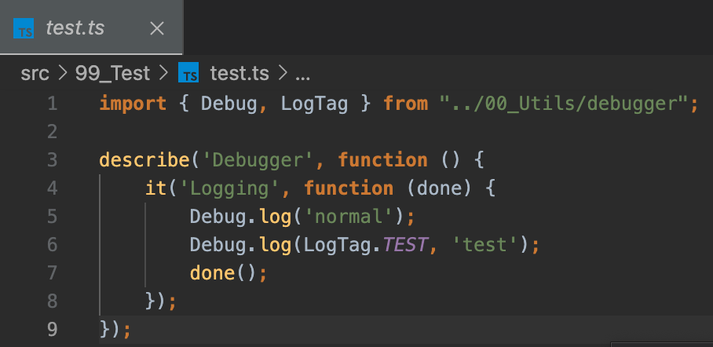

> 위 이미지처럼, 테스트 코드를 작성합니다.

이후, 터미널에서 Mocha를 실행해 단위 테스트를 진행합니다

```sh
mocha
mocha test  # test 폴더에 있는 테스트 코드들을 전부 실행 (하위 디렉터리까지 다 잡아줌)
mocha dist/test  # dist/test 폴더 ...
```

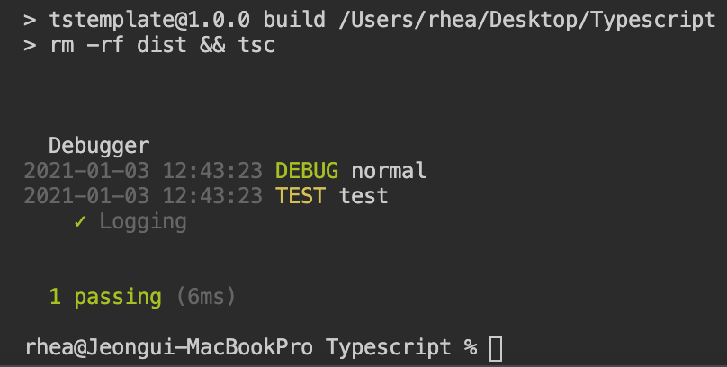

> 테스트시 위와 같이 터미널에 결과가 나옵니다

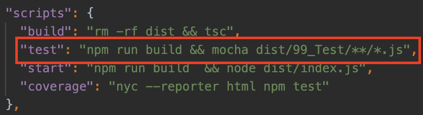

package.json에 코드를 등록해놓으면 보다 편하게 사용할 수 있습니다.

#### **VSCode Extension**

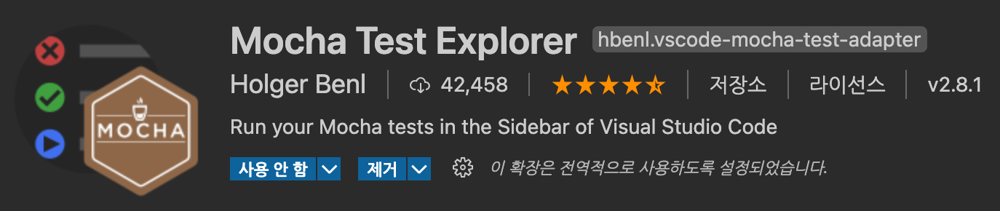

VSCode에 Mocha를 사용하기 편하게 Explorer 형식으로 제공해주는 Extension이 존재합니다.

[https://marketplace.visualstudio.com/items?itemName=hbenl.vscode-mocha-test-adapter](https://marketplace.visualstudio.com/items?itemName=hbenl.vscode-mocha-test-adapter)


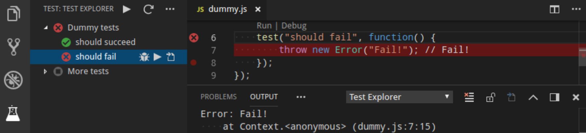

위 Extension을 설치하게 되면, VSCode에 새로운 메뉴가 생기고, 메뉴에서 위 사진처럼 테스트를 원클릭으로 편하게 테스트할 수 있습니다.

test 파일도 다 있고, mocha 명령어로 실행했을때 다 잘 잡는데 Extension 메뉴에는 안잡힌다면 아래 파일을 추가 or 수정해보세요.

```sh
vim .vscode/settings.json

{
    "mochaExplorer.files": "dist/99_Test/**/*.js",  # 본인의 테스트 파일 위치
    "mochaExplorer.envPath": "",  # 본인 환경에 맞게 설정
    "mochaExplorer.require": ""  # 본인 환경에 맞게 설정
}
```


### NYC

#### **NYC가 무엇인가요?**

테스트가 얼마나 잘 진행되고 있는지를 확인할 수 있도록, 테스트 커버리지를 잘 정리해서 보여주는 프레임워크입니다.

#### **설치 방법**

```sh
npm i nyc --save-dev
```

#### **사용 방법**

```sh
nyc mocha  # 터미널에 테스트 커버리지를 띄웁니다
nyc --check-coverage --lines 90  # 총 코드 범위가 90 % 미만이면 실패합니다
nyc --check-coverage --lines 90 --per-file  # 하나 이상의 파일의 코드 적용 범위가 90 % 미만이면 실패합니다
nyc --reporter html mocha  # 테스트 커버리지 결과를 HTML로 보여줍니다
```

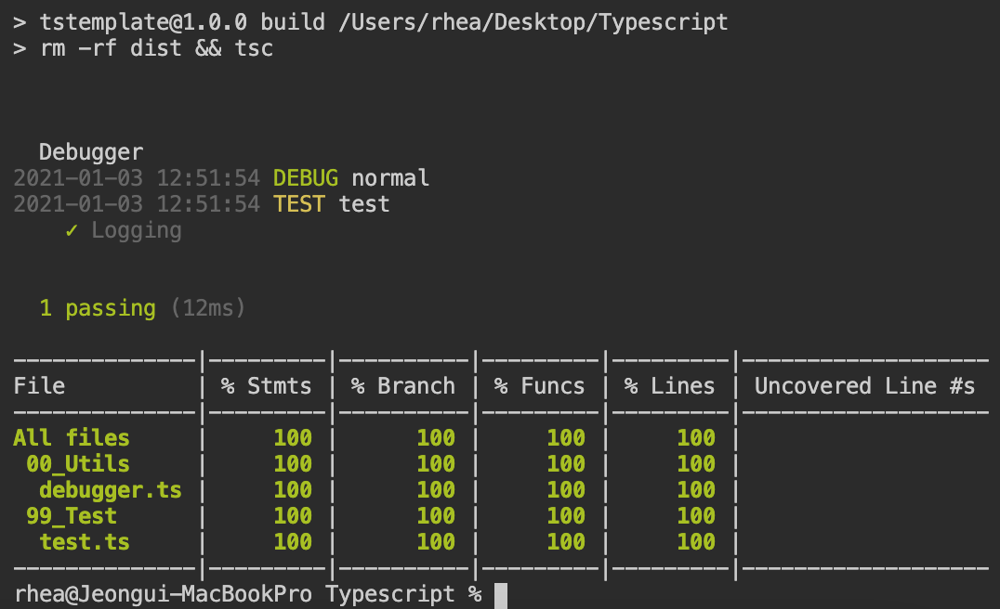

> Terminal로 출력한 경우

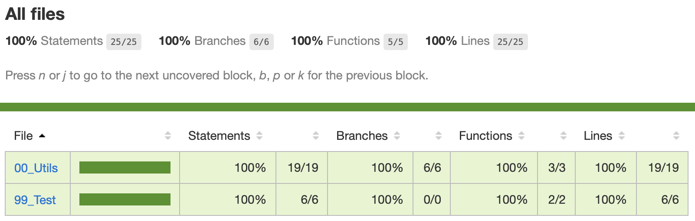

> HTML로 출력한 경우

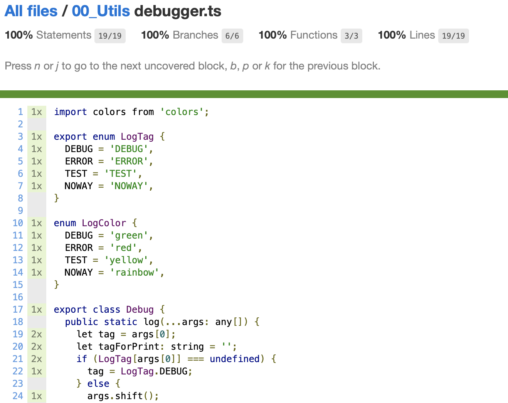

> 내부 코드들의 모든 분기를 다 테스트해서 보여줍니다

### Mocha와 NYC를 사용한 TDD Flow

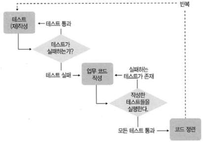

1. 개발 목표 설정
2. 테스트 코드 작성
3. 테스트 코드 리뷰
4. 메인 로직 코드 작성
5. Mocha로 단위 테스트 진행
   1. 하나라도 문제가 발생한다면, 4번으로 돌아갑니다.
6. 모든 단위 테스트가 통과했다면, NYC를 이용해 테스트 커버리지 확인
   1. 개발 팀내에서 정한 테스트 커버리지에 부합되지 않으면, 5번으로 돌아갑니다.
7. 메인 로직 코드 리뷰
8. Git Push
9.  Pull Request or Merge Request
10. CI/CD (Jenkins, CircleCI)
11. PM2 or Docker or Kubernetes에 배포 (Production 환경에 맞추어 진행)

### 다른 회사들의 TDD 적용기

* [https://speakerdeck.com/sungil/android-tdd-jeogyonggi?slide=157](https://speakerdeck.com/sungil/android-tdd-jeogyonggi?slide=157)
* [https://woowabros.github.io/study/2018/03/01/spock-test.html](https://woowabros.github.io/study/2018/03/01/spock-test.html)
* [https://blog.outsider.ne.kr/669](https://blog.outsider.ne.kr/669)

## 참고

* [https://m.blog.naver.com/suresofttech/221569611618](https://m.blog.naver.com/suresofttech/221569611618)
* [https://sjh836.tistory.com/174](https://sjh836.tistory.com/174)
* [http://blog.skby.net/tdd-test-driven-development/](http://blog.skby.net/tdd-test-driven-development/)