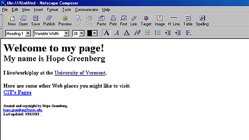

## 요약



> 1994년도 웹 브라우징 모습

하이퍼텍스트 마크업 언어(HyperText Markup Language)는 웹 페이지를 위한 지배적인 마크업 언어입니다.  

HTML은 제목, 단락, 목록 등과 같은 본문을 위한 구조적 의미를 나타내는 것뿐만 아니라 링크, 인용과 그 밖의 항목으로 구조적 문서를 만들 수 있는 방법을 제공합니다.  
그리고 이미지와 객체를 내장하고 대화형 양식을 생성하는 데 사용될 수 있습니다.  

HTML은 웹 페이지 콘텐츠 안의 꺾쇠 괄호에 둘러싸인 "태그"로 되어있는 HTML 요소 형태로 작성합니다.  
HTML은 웹 브라우저와 같은 HTML 처리 장치의 행동에 영향을 주는 자바스크립트와 본문과 그 밖의 항목의 외관과 배치를 정의하는 CSS 같은 스크립트를 포함하거나 불러올 수 있습니다.  

HTML과 CSS 표준의 공동 책임자인 W3C는 명확하고 표상적인 마크업을 위하여 CSS의 사용을 권장합니다.

## 깊게 들어가기

### 역사

**개발**


> 팀 버너스리 - World Wide Web의 창시자

1980년, 유럽 입자 물리 연구소(CERN)의 계약자였었던 물리학자 팀 버너스리가 HTML의 원형인 인콰이어를 제안하였습니다.  
인콰이어는 CERN의 연구원들이 문서를 이용하고 공유하기 위한 체계였습니다. 

1989년에 팀 버너스리는 인터넷 기반 하이퍼텍스트 체계를 제안하는 메모를 작성했습니다.  
버너스 리는 1990년 말에 HTML을 명시하고, 브라우저와 서버 소프트웨어를 작성했습니다.  

그 해에 버너스리와 CERN 데이터 시스템 엔지니어 로버트 카일리아우와 함께 CERN측에 자금 지원을 요청하였지만, 이 프로젝트는 CERN으로부터 정식으로 채택 받지 못했습니다.  

버너스리의 개인적인 기록에 1990년부터 "하이퍼텍스트가 사용되는 여러 분야의 일부"를 열거했고 백과사전을 그 목록의 첫 번째로 두었습니다.

**최초 규격**

HTML 최초의 일반 공개 설명은 1991년 말에 버너스리가 처음으로 인터넷에서 문서를 "HTML 태그"(HTML tag)로 부르면서 시작되었습니다.

그것은 머릿글자로 이루어진 20개의 요소를 기술하였고, 상대적으로 HTML의 단순한 디자인이었습니다.  
하이퍼링크를 제외한 HTML 태그들은 CERN 자체의 SGML 기반 문서화 포맷인 SGML GUID에 강하게 영향을 받았습니다.  
이 요소 중 13개는 HTML 4 버전에서도 여전히 존재합니다.

HTML은 동적인 웹 페이지의 웹 브라우저를 통한 문자와 이미지 양식입니다.  
문자 요소의 대부분은 1988년 ISO 기술 보고서 9537 SGML을 이용한 기법에서 찾을 수 있습니다.  
하지만 SGML 개념의 일반적인 마크업은 단지 개별 효과 보다는 요소 기반이고 또한 구조와 처리의 분리(?)(HTML은 CSS와 함께 이 방향으로 점진적으로 이동해 왔습니다.)

버너스리는 SGML 응용 프로그램이 되는 HTML을 고안해야 했고 그것은 공식적으로 IETF(국제 인터넷 표준화 기구)에 의하여 1993년 중반, HTML 규격에 대한 최초의 제안을 간행물로 정의했습니다. 

(버너스리와 덴 콘놀리에 의한 문법을 규정하는 SGML 문서 형식 정의(SGML DTD)가 포함된 "하이퍼텍스트 마크업 언어(HTML)" 인터넷 초안) 이 초안은 6개월 후 만료되었습니다.  

하지만 NCSA 모자이크 브라우저의 인라인 이미지를 내장하는 사용자 정의 태그의 사례는 주목할 만 했고, 성공적인 프로토타입에 대한 표준을 기반한 IETF의 철학을. 마찬가지로 데이브 라그렛의 경쟁 인터넷 초안인 "HTML+ (하이퍼텍스트 마크업 포맷)"은 1993년 말에 테이블과 기입양식 같은 요소들을 이미 구현하여 표준화 제안을 했습니다.

이후 1994년 초 HTML과 HTML+ 초안은 만료되었고, IETF는 HTML 작업 그룹을 설립해 1995년에 HTML 2.0을 완성합니다. 최초의 HTML의 규격은 미래에 수행될 HTML 표준을 기반으로 간주되는 경향이 있었습니다.

RFC 1996년에 HTML 2.0은 HTML과 HTML+ 초안의 아이디어가 포함됐다고 발표했습니다.  
HTML 2.0 지정은 이전의 초안들로부터 새로운 버전을 구별하기 위해서였습니다.

게다가 IETF의 후원하에 개발은 상충하는 이해 관계 때문에 지연되었습니다.  
1996년부터 HTML 규격은 상용 소프트웨어 제작사의 투입으로 월드 와이드 웹 컨소시엄(W3C)에서 유지해 왔습니다.  

하지만 2000년부터 HTML 또한 국제 표준(ISO/IEC 15445:2000)이 되었습니다.  

W3C는 2014년 10월 28일 [HTML5](https://ko.wikipedia.org/wiki/HTML5) 표준안을 확정했다고 발표했습니다.

이후 2016년 11월 1일 HTML5의 마이너 업데이트 버전인 HTML5.1 표준안을 확정, 2017년 12월 14일 HTML5.2 표준안을 확정했습니다.  
HTML5.3 표준안은 현재 작업 초안 단계로 진행 중입니다.


### 마크업

HTML 마크업은 HTML 요소(엘리먼트, Elements)와 그들의 속성(Attributes)과 문자 기반 데이터 형태와 문자 참조와 엔티티 참조를 포함하는 몇 가지 핵심 구성 요소로 이루어져 있습니다. 

또 다른 중요한 구성 요소로는 문서 형식 정의(DTD, Document Type Definition)를 명시하는 문서 형식 선언(document type declaration)입니다.  
차기 HTML 5에서는 DTD를 지정하지 않아도 되고 오직 레이아웃 모드로 지정되었습니다.

`Hello world` 프로그램은 프로그래밍 언어와 스크립트 언어 그리고 마크업 언어를 비교하기 위해 사용되는 일반적인 컴퓨터 프로그램입니다.  

그리고 HTML에서의 `Hello world` 프로그램은 단 9줄에 불과합니다.

```html
<!doctype html>
<html>
  <head>
    <title>Hello HTML</title>
  </head>
  <body>
    <p>Hello World!</p>
  </body>
</html>
```

> `<html>`과 `</html>`사이의 문자는 웹 페이지를 표현합니다.  
> `<body>`와 `</body>`사이의 문자는 표시되는 페이지의 내용이며,  
> `<head>`와 `</head>`사이의 문자는 눈에는 보이지 않지만 웹 페이지를 표현하기위해 필요한 해더 정보를 담고 있습니다.  
> `<title>`과 `</title>`사이의 문자는 웹 브라우저의 페이지 제목을 정의하는데 사용되었습니다.

Hello world 프로그램을 최대로 짧게 만들고 싶다면

```html
Hello world
```

이라고 해도 되지만, 웹 표준에 위배됩니다.  
이 문서 형식 정의는 HTML 5입니다.  
만약 `<!doctype html>`로 선언하지 않은 경우 대다수의 브라우저는 "쿼크 모드"로 렌더링합니다.

> 쿼크 모드(Quirks mode, 쿽스 모드)는 오래된 웹 브라우저를 위하여 디자인된 웹 페이지의 하위 호환성을 유지하기 위해 W3C나 IETF의 표준을 엄격히 준수하는 표준 모드(Standards Mode)를 대신하여 쓰이는 웹 브라우저 기술을 가리킨다.  
> 같은 코드라도 웹 브라우저마다 서로 다르게 해석하므로 전혀 다른 결과물을 보여주게 되었습니다.

**HTML 요소**

HTML 문서는 완전한 HTML 요소로 구성되어 있고,  
HTML 요소의 가장 보편적인 형태는 세 가지 구성 요소를 가집니다.

> "시작 태그"(Start Tag)와 "종료 태그"(End Tag) 와 같은 태그 한 쌍

몇 가지 요소 속성은 그 태그들 내에서 특성을 부여합니다.  
마지막으로 문자와 그래픽 정보 콘텐츠를 화면에 표현합니다.

HTML 요소는 태그의 사이와 포함되는 모든 것입니다.  
태그는 꺾쇠괄호(<>)로 둘러싸인 키워드입니다.

**HTML 요소의 일반적인 형태**

```html
<tag>보이는 내용</tag>
```

HTML 요소의 이름은 태그의 이름입니다.  
그리고 종료 태그의 이름은 슬래시 문자 ("/")로 시작되었습니다.

**HTML 요소의 가장 보편적인 형태**

```html
<tag attribute1="value1" attribute2="value2">보이는 내용</tag>
```

속성이 주어지지 않습니다면 시작 태그의 기본값을 사용하게 되었습니다.

**태그의 기본적인 형태**

HTML의 머리부분 (`<head>`...`</head>`), 보통 제목은 `<head>`의 안에 포함되었습니다.

```html
<head>
<title>제목</title>
</head>
단락 구획[편집]
<p>단락 1</p> <p>단락 2</p>
```

새 줄(`<br>`), `<br>` 와 `<p>` 간의 차이점은 'br'은 페이지의 의미론적 구조를 변경하지 않는 줄바꿈(breaks a line)인 반면 'p'는 단락으로 페이지를 구분합니다.

```html
<code><p>이것은 <br /> 줄바꿈을 <br /> 포함하는 <br /> 단락입니다. </p></code>
```

**주석 사용**

```html
<!--..설명!..-->
```
주석은 코딩을 이해하는데 도움을 줄 수 있지만 웹 페이지에는 표시되지 않습니다.

**HTML에서 사용되는 마크업 요소의 형태**

구조적 마크업은 본문의 목적을 표현합니다.  

예를 들어, `<h2>`골프`</h2>`는 "골프"를 두 번째 수준의 제목으로 규정합니다.  
그리고 그것은 브라우저에서 이 장의 처음에 나오는 HTML 마크업 제목과 유사한 방식으로 해석될 것입니다. 

구조적 마크업은 어떤 특정한 렌더링을 표시하지 않지만, 대부분의 웹 브라우저는 요소 포맷팅에 대한 기본적인 스타일을 표준화했습니다.  
텍스트는 캐스캐이딩 스타일시트(CSS)로 더 꾸밀 수 있습니다.

표현적 마크업은 기능에 관계없이 본문의 외관을 표현합니다.  
예를 들어, `<b>`굵은 글씨`</b>`는 시각적 결과 장치가 굵은 글씨 속에 있는 "boldface"를 해석해야 합니다는 것을 지시하지만,  
이것을 할 수 있는 장치가 무엇을 해야 할 지(예를 들어 텍스트를 크게 읽어주는 장치와 같은 )에 대한 어떠한 지시도 하지 않습니다. 

`<b>`굵게`</b>`와 `<i>`이탤릭`</i>`과 같은 경우에는 보통 시각적 해석에 필적하는 여러 가지 요소가 있지만, 본래가 더 의미론적입니다.  
즉, 각각 `<strong>`strong emphasis`</strong>`와 `<em>`emphasis`</em>`같이 할 수 있습니다.  

음성 사용자 에이전트가 어떻게 후자의 두 요소를 해석하는 지 지켜보는 것은 쉽습니다.  
그러나 그것은 그들의 표현 상대와 맞먹지는 않습니다. 

예를 들자면 책의 이름을 강조하는 것이 스크린을 읽는 유저에게는 바람직하지 않지만, 화면에서 그러한 이름이 이탤릭체로 될 것입니다.  
대부분의 표현 마크업 요소는 스타일 디자인에 근거한 CSS에 호응해서 HTML 4.0 스펙에서는 받아들여지지 않을 것입니다.

하이퍼텍스트 마크업은 다른문서와 연결시켜주는 문서의 부분입니다.  
XHTML 1.1 버전을 통한 HTML은 본문속에서 하이퍼링크를 생성하기위해 anchor 요소(`<a>`내 블로그`</a>`)의 사용을 필요로 합니다.  

덧붙여, href 속성은 반드시 정확한 URL을 설정해야만 합니다.  
예를 들어, HTML 마크업인 `<a href="https://rhea-so.github.io/">`내 블로그`</a>`는 하이퍼링크로써 "내 블로그" 처럼 보일 것입니다.

하이퍼링크로써 이미지를 표현하는 예제

```html
<a href="http://example.org"></a>
```

**주요 HTML 요소들**

* `<br>` 줄바꾸기
* `<p>` 단락바꾸기(한줄 떨어짐)
* `<hr>` 가로줄
* `<center>...</center>` ...을 가운데 정렬
* `<font>...</font>` ...의 폰트를 바꿈
* `<ul><li>...<li>...</ul>` ...을 순서없는 목록으로 만듦(기본: 까만동그라미)
* `<ol><li>...<li>...</ol>` ...을 순서있는 목록으로 만듦(기본: 숫자)
* `<table></table>` 표만들기
* `<tr></tr>` 행(<table>...</table>...에 넣는다)
* `<td></td>` 열(<tr>...</tr> ...에 넣는다)
* `<td colspan=숫자></td>` 그 셀부터 숫자만큼의 오른쪽 셀을 병합합니다
* `<td rowspan=숫자></td>` 그셀부터 숫자만큼의 아래쪽 셀을 병합합니다

**속성**

대부분의 요소 속성들은 이름-값 형태이고, "="로 구분하고, 요소의 시작 태그 안에서 요소의 이름 다음에 쓰입니다.  
값은 외따옴표 또는 쌍따옴표로 둘러쌀 수 있습니다.  
비록 어떤 문자로 구성된 값들이 HTML에서 인용부호 없이 사용될 수도 있지만(XHTML에서는 허용되지 않음), 그 값은 따옴표나 쌍따옴표 또는 쌍 인용부호로 둘러쌀 수 있습니다.

인용부호를 사용하지 않고, 속성값을 사용하는 것은 안전하지 않습니다.

이름값 쌍 속성과 대조하여, 요소 태그의 시작에 단순히 그 존재만으로도 영향을 끼칠 수 있는 태그가 있습니다.

대부분의 요소는 몇 가지 일반적인 속성을 가질 수 있습니다.

id 속성은 요소에 대한 문서 전체의 고유 식별자를 제공합니다.  
이것은 스타일시트에 의해 외관적인 특성을 제공하고, 브라우저에 의해 특정 요소를 처리하거나 스크립트에 의해 요소의 내용이나 외관을 바꿀 수 있습니다.  
페이지의 URL에 달려 있는 것처럼, 보통 페이지 다음에 오는 요소에 대한 세계에서 유일한 식별자를 부여합니다.  

예를 들어, https://en.wikipedia.org/wiki/HTML#Attributes 에 있는 ID 속성과 같습니다.
class 속성은 유사한 요소를 분류하는 방법을 제공합니다.  
이것은 어휘적 또는 표현적 목적으로 사용될 수 있습니다.  

예를 들어, 어휘적으로 분류는 미세 포맷에 사용되었습니다.  
표현적 목적으로 HTML 문서는 class="notation"과 같은 지정자에서, 이 class 값을 갖는 모든 요소는 문서의 주 텍스트에 종속되었습니다는 것을 지시합니다. 이러한 요소는 HTML 소스에서 나타났던 장소에 나타나는 대신에 함께 모여서 페이지에서 각주와 같이 표현되었습니다.  

작성자는 특정 요소에 표현적 속성을 지닌 style 비 속성 코드를 사용할 것입니다.  
단순하고, 특정한 또는 특수한 스타일 속성을 가진 애플리케이션에서는 너무 성가시긴 하지만, 스타일시트로 속성을 선택할 때는 요소의 id나 class 속성을 사용하는 것이 더 낫다고 간주되었습니다.  

title 속성은 요소에서 숨겨진 뜻을 설명하는 글을 첨부하는 곳에 사용되었습니다.   
대부분의 브라우저의 이 속성은 자주 툴팁과 같이 참조하는 것처럼 보입니다.  

단축 요소(abbr)는 아래와 같이 다양한 속성을 설명하는데 쓰일 수 있습니다

```html
<abbr id="anId" class="aClass" style="color:blue;" title="하이퍼텍스트 마크업 언어">HTML</abbr>
```

이 예제는 대부분의 브라우저에서 HTML처럼 보입니다.  
이 단축에 커서를 가리키면 그 제목인 "하이퍼텍스트 마크업 언어"가 보일 것입니다.

대부분의 요소 또한 언어와 관련된 속성인 lang과 dir을 취합니다.

**데이터 형식**

HTML은 스크립트 데이터와 스타일시트 데이터, 그리고 ID, 이름, URI, 숫자 길이의 단위, 언어, 미디어 기술자, 색상, 문자 인코딩, 날짜와 시간 등을 포함하는 속성 값의 종류를 위한 몇 가지 데이터 형태를 정의 내린다.  
이러한 모든 데이터 형식은 문자 데이터를 최적화하기 위하여 분리되었습니다.

**문서 형식 선언**
HTML 문서는 문서 형식 선언 (비공식적으로, "doctype")으로 시작해야 합니다.  
브라우저에서 doctype의 기능은 렌더링 모드를 지시하는 것이며, 부분적으로는 쿼크 모드를 피하기 위한 목적도 있습니다.

doctype의 원래의 목적은 문서 형식 정의 (DTD)에 기반한 SGML 도구를 통하여 HTML 문서의 파싱과 유효 여부 확인을 가능하게 하려는 것이었습니다.  
DOCTYPE에 대한 DTD는 DTD에 순응하는 문서를 가진 허용 또는 금지된 내용을 지정하고 기계가 읽을 수 있는 문법을 포함하도록 지시합니다. 

반면 브라우저는 HTML을 SGML의 애플리케이션으로 수행하지 않으며, 결과적으로 DTD를 읽지 않습니다.  
HTML 5는 기술적인 제한으로 인해 DTD를 정의하지 않습니다.   
그래서 HTML5에서 doctype 선언 `<!doctype html>`는 DTD를 참조하지 않습니다.

HTML 4 doctype의 예제는 다음과 같습니다.

```html
<!DOCTYPE HTML PUBLIC "-//W3C//DTD HTML 4.01//EN" "http://www.w3.org/TR/html4/strict.dtd">
```
이런 선언은 엄격한 HTML 4.01을 만들기 위해 DTD를 참조합니다.  
이것은 선언적인 요소인 font 같은 요소는 포함하지 않으며, CSS나 span, div 요소는 유지합니다.  
SGML 기반의 유효 확인자(validator)들은 문서를 적절히 해석하거나, 유효 여부 확인을 실행하기 위해 DTD를 읽는다.

최근의 브라우저에서 이 doctype은 쿼크 모드에 반대되는 표준 모드를 활성화합니다.

게다가 HTML 4.01은 임시적이고 프레임 단위의 DTD를 제공합니다.

## 참고

* [wikipedia - HTML](https://ko.wikipedia.org/wiki/HTML)