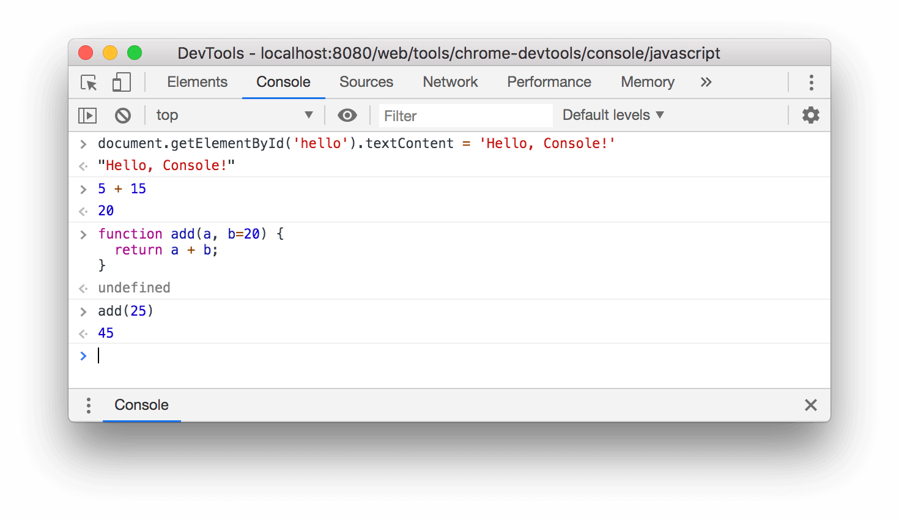
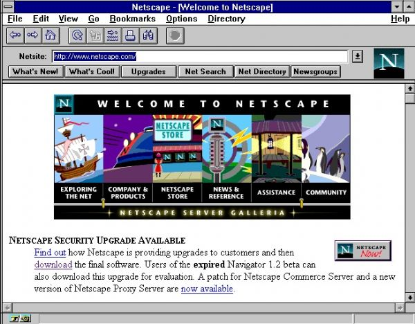

## 요약



> 웹 브라우저 콘솔에서 Javascript를 사용하는 모습

자바스크립트(영어: JavaScript)는 객체 기반의 스크립트 프로그래밍 언어입니다.  
이 언어는 웹 브라우저 내에서 주로 사용하며, 다른 응용 프로그램의 내장 객체에도 접근할 수 있는 기능을 가지고 있습니다.  

또한 **Node.js**와 같은 런타임 환경과 같이 서버 프로그래밍에도 사용되고 있습니다.  
자바스크립트는 본래 넷스케이프 커뮤니케이션즈 코퍼레이션의 브렌던 아이크(Brendan Eich)가 처음에는 모카(Mocha)라는 이름으로,  
나중에는 라이브스크립트(LiveScript)라는 이름으로 개발하였으며, 최종적으로 자바스크립트가 되었습니다. 

자바스크립트가 썬 마이크로시스템즈의 자바와 구문이 유사한 점도 있지만, 이는 사실 두 언어 모두 C 언어의 기본 구문에 바탕을 뒀기 때문이고, **자바와 자바스크립트는 직접적인 관련성이 없습니다.**  
이름과 구문 외에는 자바보다 셀프나 스킴과 유사성이 많습니다.

ECMA스크립트는 쉽게 말해 자바스크립트의 표준화된 버전입니다.  
모질라 1.8 베타 1이 나오면서 XML에 대응하는 확장 언어인 E4X(ECMA-357)를 부분 지원하게 되었습니다. 

자바스크립트는 브라우저마다 지원되는 버전이 다릅니다.

## 깊게 들어가기

### 역사

**넷스케이프에서의 시작**



1993년, 일리노이 대학교 어배너-섐페인의 NCSA는 최초의 대중적인 그래픽 웹 브라우저인 NCSA 모자이크를 출시하였습니다.  

1994년, 모자이크 커뮤니케이션스라는 이름의 회사가 캘래포니아주 마운틴 뷰에 설립되었으며 모자이크 넷스케이프를 만들기 위해 오리지널 NCSA 모자이크 개발자들을 고용하였습니다.  

그러나 NCSA 모자이크와 코드는 의도적으로 공유하지 않았습니다.  
이 기업의 브라우저의 내부 코드명은 모질라였으며 이는 "Mosaic and Godzilla"에서 비롯된 용어입니다.

이 웹 브라우저의 첫 버전인 모자이크 넷스케이프 0.9는 1994년 말에 출시되었습니다.  
4개월 후 브라우저 시장의 3/4를 잠식하면서 1990년대에 주된 웹 브라우저가 되었습니다.  
NCSA의 상표 소유권 문제를 회피하고자 이 브라우저는 같은 해에 "넷스케이프 내비게이터"로 이름을 바꾸었으며 이 기업은 "넷스케이프 커뮤니케이션스"라는 이름을 취하였습니다.  

넷스케이프 커뮤니케이션스는 웹이 더 동적으로 변화할 필요가 있었음을 실감했습니다.  
기업의 설립자 Marc Andreessen은 HTML에 코드를 웹 페이지 마크업으로 직접 작성하면서 웹 디자이너들과 파트타입 프로그래머들이 이미지, 플러그인 등의 요소를 쉽게 조합할 수 있는 글루 언어(glue language)가 필요했습니다고 믿었습니다.

1995년, 넷스케이프 커뮤니케이션스는 스킴 프로그래밍 언어를 넷스케이프 내비게이터에 임베디드하기 위해 브렌던 아이크를 영입하였습니다.  
시작 전에 넷스케이프 커뮤니케이션스는 넷스케이프 내비게이터 썬의 더 정적인 프로그래밍 언어인 자바를 포함시키기 위해 썬 마이크로시스템즈와 협업했으며 이는 사용자에게 웹 기술 및 플랫폼을 채택시키려는 마이크로소프트와 경쟁하기 위해서였습니다.

넷스케이프 커뮤니케이션스는 이때 자신들이 만들기 바랐던 스크립트 언어가 자바를 구현할 것이고 비슷한 문법을 채용하는 것이 좋겠다고 생각했으며 펄, 파이썬, Tcl, 스킴 등 기타 언어를 채택하는 것을 배제하였습니다.  
경쟁적인 제안에 대항하여 자바스크립트 개념을 방어하기 위해 이 기업은 프로토타입이 필요했습니다.  
아이크는 1995년 5월 10일 안에 이를 작성했습니다.

원래 모카(Mocha)라는 이름으로 개발되었으나 이 언어는 공식적으로 라이브스크립트(LiveScript)로 불렸으며 이 당시 1995년 9월 넷스케이프 내비게이터 2.0의 베타 릴리스가 이루어졌으나 나중에 이름이 자바스크립트로 바뀌었는데 이는 12월 넷스케이프 내비게이터 2.0 베타 3에 채용되었습니다.  

이름의 최종 선정에 혼란이 야기되었는데 이 언어가 자바 프로그래밍 언어에서 파생되었습니다는 인상을 심었으며 이러한 선택이 마케팅적인 특징을 보였고 이는 넷스케이프가 당시 인기있는 웹 프로그래밍 언어로서 자바스크립트를 내밀기 위한 것이었습니다.

### 자바와 자바스크립트, 그리고 J스크립트

라이브스크립트의 이름이 자바스크립트로 변경된 것은 대략 넷스케이프가 자사의 넷스케이프 내비게이터 웹 브라우저에 자바 기술에 대한 지원을 포함하기 시작할 즈음입니다.  

자바스크립트는 1995년 12월 출시된 넷스케이프 2.0B3에서부터 공개, 채택되었습니다.  
자바스크립트라는 이름은 상당한 혼란을 가져왔습니다.  

이것은 자바와 자바스크립트 간에는 구문이 유사하다는 점(양쪽 모두 C에 바탕을 두었기 때문에) 외에는 실제 관련성이 없었기 때문입니다.  
두 언어는 의미론적으로 매우 다르고, 특히 각각의 객체 모델은 관련성이 없는 데다가 상당 부분이 호환되지 않습니다.

웹 페이지 향상 언어로서 자바스크립트의 성공에 자극받은 마이크로소프트는 J스크립트로 알려진 호환 언어를 개발하게 되었습니다.  
J스크립트는 1996년 8월에 출시된 인터넷 익스플로러 브라우저 3.0부터 지원 되기 시작했습니다.  
IE 브라우저에서의 자바스크립트 사용은 실제로는 J스크립트의 사용을 의미하는 것이었습니다.  

이에 대한 표준화 요구는 ECMA스크립트에 대한 ECMA-262 표준의 기반이 되었으며, 1996년 11월 이후 세 번째 판까지 출판되었습니다.  
자바스크립트와 함께 자주 쓰이는 용어인 DOM은 사실 ECMA스크립트 표준의 일부가 아니며, 그것은 자체로 하나의 표준이고 XML에 기반을 둡니다.

### 상표

"자바스크립트"(JavaScript)는 오라클의 상표입니다.  
넷스케이프 커뮤니케이션스가 발명, 구현한 기술 및 모질라 재단과 같은 독립 기관의 라이선스 하에 사용됩니다.

### 헬로 월드 프로그램

아래는 자바스크립트와 HTML5로 이루어진 헬로 월드 프로그램이며, 실선 내부가 자바스크립트로 처리된 부분을 설명합니다.

```html
<!DOCTYPE HTML>
<html>
    <head>
      <meta http-equiv="Content-Type" content="text/html" charset="UTF-8" />
      <title>자바스크립트 페이지</title>
      <script type="text/javascript">
        document.write("<p>Hello World!</p>");
      </script>
    </head>

    <body>
      <noscript>
        <p>브라우저가 자바스크립트 기능을 지원하지 않거나 자바스크립트 기능이 꺼져 있습니다.</p>
      </noscript>
    </body>
</html>
```

### 문법

**단순 문법**

자바스크립트의 변수는 `var`, `let`, `const` 키워드를 사용하여 정의할 수 있습니다.

```js
// Declares a function-scoped variable named `x`, and implicitly assigns the
// special value `undefined` to it.
var x;

// More explicit version of the above.
var x2 = undefined;

// Declares a block-scoped variable named `y`, and implicitly sets it to
// `undefined`. The `let` keyword was introduced in ECMAScript 2015.
let y;

// More explicit version of the above.
let y2 = undefined;

// Declares a block-scoped, un-reassign-able variable named `z`, and sets it to
// `undefined`. The `const` keyword was also introduced in ECMAScript 2015, and
// must be explicitly assigned to.
const z = undefined;

// Declares a variable named `myNumber`, and assigns a number literal (the value
// `2`) to it.
let myNumber = 2;

// Reassigns `myNumber`, setting it to a string literal (the value `"foo"`).
// JavaScript is a dynamically-typed language, so this is legal.
myNumber = "foo";
```

**HTML과 자바스크립트**

HTML은 < > 태그로 엘리먼트(element)를 정의합니다면, 이러한 HTML의 `<body>` Hello, World! `</body>` 엘리먼트에 일대일 대응하는 자바스크립트(ECMA스크립트)는

```js
document.body.innerText = "Hello, World!";
```

처럼 정의됩니다.  
여기서처럼 HTML과 자바스크립트 간에는 광범위한 호환성을 보장하는 동전의 양면성 같은 구조를 엿볼 수 있는데, 이것이 가능한 것은 DOM 때문이라고 말할 수 있습니다.

한편 자바스크립트는 HTML과의 연동관계에서 HTML의 로딩시점 또는 초기화와 관련된 즉시 실행 함수(Immediately invoked function expression)를 제공합니다.

### 버전 역사

| 버전  |                  출시일                   |                           내용                           | 넷스케이프 |  내비게이터  | 모질라 | 파이어폭스 | 인터넷 | 익스플로러 | 오페라 | 사파리 |     크롬     |
| :---: | :---------------------------------------: | :------------------------------------------------------: | :--------: | :----------: | :----: | :--------: | :----: | :--------: | :----: | :----: | :----------: |
|  1.0  |                1996년 3월                 |                           2.0                            |    3.0     |      -       |   -    |     -      |   -    |     -      |   -    |   -    |      -       |
|  1.1  |                1996년 8월                 |                           3.0                            |     -      |      -       |   -    |     -      |   -    |     -      |   -    |   -    |      -       |
|  1.2  |                1997년 6월                 |                         4.0-4.05                         |     3      |      -       |   -    |     -      |   -    |     -      |   -    |   -    |      -       |
|  1.3  |                1998년 10월                |                ECMA-262 1st + 2nd edition                | 4.06-4.7x  |     4.0      |   5    |     -      |   -    |     -      |   -    |   -    |      -       |
|  1.4  |                넷스케이프                 |                           서버                           |     6      |      -       |   -    |     -      |   -    |     -      |   -    |   -    |      -       |
|  1.5  |                2000년 11월                |                   ECMA-262 3rd edition                   |    6.0     |     1.0      |  5.5   |     6      |   7    |     8      |  7.0   | 3.0-5  | 1.0-10.0.666 |
|  1.6  |                2005년 11월                |   1.5 + array extras + array and string generics + E4X   |    1.5     |      -       |   -    |     -      |   -    |     -      |   -    |   -    |      -       |
|  1.7  |                2006년 10월                |       1.6 + Pythonic generators + iterators + let        |    2.0     | 28.0.1500.95 |   -    |     -      |   -    |     -      |   -    |   -    |      -       |
|  1.8  |                2008년 6월                 |    1.7 + generator expressions + expression closures     |    3.0     |    11.50     |   -    |     -      |   -    |     -      |   -    |   -    |      -       |
| 1.8.1 | 1.8 + native JSON support + minor updates |                           3.5                            |     -      |      -       |   -    |     -      |   -    |     -      |
| 1.8.2 |              2009년 6월 22일              |                  1.8.1 + minor updates                   |    3.6     |      -       |   -    |     -      |   -    |     -      |
| 1.8.5 |              2010년 7월 27일              | 1.8.2 + new features for ECMA-262 5th edition compliance |    4.0     |      -       |   -    |     -      |   -    |     -      |

### 프로그래밍 언어

한편 자바스크립트에서 사용되는 기초적인 문법의 개념으로는 속성과 메소드를 갖는 객체(오브젝트) 개념이 있으며, 변수 선언, 함수 정의, 연산자 그리고 제어문등을 이 프로그래밍 언어의 주요 개념으로 언급할수 있을 뿐만 아니라 이 언어가 속한 객체 지향 프로그래밍언어(OOP)의 공통적인 주요 개념이기도 합니다.

## 참고

* [wikipedia - Javascript](https://ko.wikipedia.org/wiki/자바스크립트)
* [ECMA스크립트](https://ko.wikipedia.org/wiki/ECMA스크립트)
* [DHTML](https://ko.wikipedia.org/wiki/DHTML)
* [자바스크립트 엔진](https://ko.wikipedia.org/wiki/자바스크립트_엔진)
* [Ajax](https://ko.wikipedia.org/wiki/Ajax)
* [jQuery](https://ko.wikipedia.org/wiki/JQuery)
* [프로토타입 자바스크립트 프레임워크](https://ko.wikipedia.org/wiki/프로토타입_자바스크립트_프레임워크)