## 사연

서울에서 살기 시작한지 어느덧 479일 째 되는 날입니다. (글쓴 날)  
이렇게 시간이 지나가고, 국방부의 시계가 흐르는 와중에도, 제 삶에는 아무런 변화가 없었습니다.

저는 아직도 서울 입성할때 들어간 고시원에서 아직도 살고 있습니다 T_T

### 왜 아직도 고시원을 탈출 못했냐 하면..

고시원에 살면 돈을 빨리 모을 수 있을거라 생각했고, 돈을 모아 더 좋은 집을 들어가는 큰 그림까지 그려보았습니다만..  
현실이 그렇게 호락호락하지가 않더라구요.

1. 방이 좁으니까, 뭘 하려고 하면 밖에 나가야하고.. 밖에 나가면 돈을 자연스레 쓰게 되고..
2. 밥도 방에서 못해먹으니,, 살인적인 강남 물가를 온 몸으로 버텨내야하고..
3. 그렇다고 고시원 월세가 싼 것도 아니고.. (무슨 1평 월세가 50이야?)
4. 사고 싶은 것이나, 하고 싶은 것이 있으면 참지 못하고 바로 해버리는 스타일이라..

아무튼 돈이 영 모이질 않았습니다.  
돈이 안모이니 나갈 생각은 자연스레 떠오르지가 않더라구요.

이게 내 삶인가... 라고 생각하면서 받아드리면서 살고 있었습니다.

### 어떻게든 고시원을 탈출해야겠다는 생각

제 옆 호실에 새로운 분이 들어오셨습니다.  
그리고 이분에게서 민원을 벌써 2차례나 받았습니다.

사유는 소음.

제가 방에서 전화하는 소리가 매우 시끄럽다는 겁니다.

그래서 방에서 마음껏 전화를 못하게 되었습니다.  
데시벨이 약 40 ~ 60 정도인데도 말입니다.

반대로, 저도 소음으로 인한 스트레스를 겪고 있습니다.

옆 방에서 알람 울리는 소리, 다른 방 들어갈때 문 닫히는 쾅 소리...  
집 바로 앞이 오락실이라 삐슝빠슝 귀를 찌르는 소리에, 술집도 있어서 시끄럽게 떠드는 소리, 차 쌩쌩 지나가는 소리.. 등등

잠을 통 재대로 못자니 회사에서 일을 재대로 할 수나 있을까요..

게다가 방에는 온갖 벌레들이 들끓었고, 곰팡이도 잔뜩 피고, 공기도 탁하고, 공간도 좁고, 천장도 낮고...

빨래를 하게 되면, 다른 사람들과 공용으로 사용하는 세탁기와 건조기를 사용하기 때문에 양말이 하나씩 사라지는 일은 허다했습니다.  
다른 사람들이 사용한다고 제가 빨래를 돌리지 못한 일들도 있었고..

더 이상 고시원에 있기는 나도 지치고, 다른 사람들에게도 민폐라 생각되었고,  
"빠른 시일내에 좋은 집을 구해 꼭 이사를 하리라..!"라는 다짐을 하게 되었습니다.

## 난생 처음해보는 집 알아보기

> 이사를 합시다!

성인이 되고 난 다음, 처음으로 해보는 집구하기여서 굉장히 설렜습니다.  
이제야 진짜 자취를 하게 되는구나..!!

다짐을 한 즉시, 바로 행동으로 옮겼습니다.

그렇게 서울을 잘 알지도 못하는 우물 속 개구리인 시골 청년의 서울 집 구하기 프로젝트가 시작되었습니다.

### 제 나름 생각해본 방 구하기 기준

1. 소음 (제일 중요. 밖에서 내 소리가 안들리고, 옆집 소리 안들리고..)
2. 해충
3. 교통 (얼마나 강남과 가까운가??)
4. 방 크기
5. 방 옵션
6. 보안 (집 들어가기 전 보안 과정을 거치나?)

### 새로운 집에서 꼭 하고 싶은 것들

1. 작업실 만들기 (이제 밖에서 돈쓰지 말자)
2. 요리
3. VR
4. 욕조 (집에서 꼭 목욕하고 싶어요)
5. 게스트 초대하기!

### 어른들께 받은 조언들

1. 최대한 많은 집을 둘러보며, 눈을 익힐 것
2. 집 보자마자 괜찮다고 바로 덜컥 계약하지 말 것
   1. 훨씬 더 좋은 매물들이 있으면, 보고 배 아파 죽는다. (가성비, 퀄리티 등등)
   2. 꼭 여러 부동산들을 거쳐볼 것
3. 마음에 드는 집을 여러개 찾고 난 후, 이 중에서 하나를 정할 것
   1. 마음에 드는 집을 하나 찾자마자 바로 정하면, 1번과 같은 문제가 발생할 수 있다
4. 마음에 드는 집의 대출 여부를 확인할 것
   1. 공인중개사 왈, 보증금 3000만원까지는 세입자에게 우선권이 있어서 돈을 돌려받는데 전혀 문제가 없다고 한다.
5. 마음에 드는 집의 공과금 잔금 여부를 확인할 것 
   1. 확인 요소
      1. 가스
      2. 전기
      3. 수도
   2. 이전에 살던 사람이 돈을 안내고 갔으면, 내가 내야하는 다이나믹한 상황이 펼쳐짐.. 내가 쓰지도 않은 것들을 내야하면 아깝잖아?
6. 인터넷은 꼭 이사 일주일 전에 신청해둘 것
   1. 가스, 전기, 수도와는 다르게 시간이 걸리는 작업임
7. 계약 후, 빠른 시일내에 확정일자와 전입신고를 한번에 할 것
   1. 전입신고와 확정일자는 동사무소에 민증과 계약서를 들고가면 할 수 있음
   2. 동시에 하게 되면, 법적 효력이 더 좋다고 들음
   3. 신고한 다음 날 0시부터 효력이 있음
   4. 보증금을 지키는데 사용됨
8. 마음에 드는 집은 먼저 가계약을 할 것
   1. 가계약을 하면, 다른 사람들이 집 계약 못한다! 우선 순위는 무조건 가계약을 한 사람들에게 있다
   2. 가계약을 하고 난 다음 취소하게 되면, 가계약시 걸은 돈을 돌려받지 못한다

### 집 알아볼때 사용한 것들

1. 집토스 [https://ziptoss.com](https://ziptoss.com)
   1. 집 계약시, 복비 안내도 됨 (집 주인에게서만 받는 구조)
   2. 수수료 0원 (프로모션 이벤트를 3월 31일까지 한다고 하네요)
   3. 아침에 문의 넣으면, 당일 오후에 바로 집 구경 가능
   4. 하루에 최대 5개까지 문의 가능
   5. 한번 지정된 매니저는 변경되지 않는 것 같음 (같은 지역 내 한정)
   6. 저같은 경우는 이 어플 엄청 많이 애용했습니다.  
      만난 중개사분들 전부 다 엄청 친절하셨어요.
2. 피터팬의 좋은 집 구하기 [https://www.peterpanz.com](https://www.peterpanz.com)
   1. 직거래가 많음
   2. 허위 매물이 많은 것 같았음..
   3. 집이라고 해놓고 고시원인 경우가 있었음.. (고속터미널 쪽)
3. 해당 지역 공인중개사

### 예산 1차

예산은 300/50으로 잡았습니다. (관리비 포함)

### 첫날

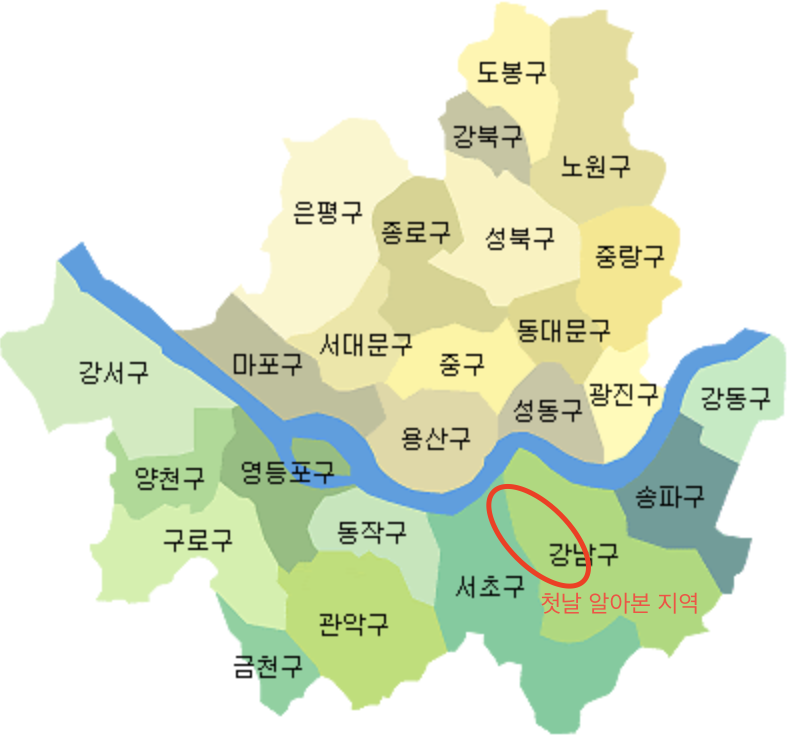

회사를 걸어갈 수 있는 거리인 반포동부터 먼저 알아보았습니다.

매물 개수가 신논현에 5개정도 있었는데, 다 방 컨디션이 영...

게다가 다 반지하였습니다. 

본 모든 반지하들은 다 공기청정기를 엄청 시끄럽게 풀로 돌리고 있었습니다..

직감이 바로 오더라구요...

반지하는 살 곳이 안된다는 것을..

와,.. 무슨 해도 안들고,,. 비오면 어우.. 끔찍해..

너무 충격적이어서 사진은 올리지 않겠습니다.

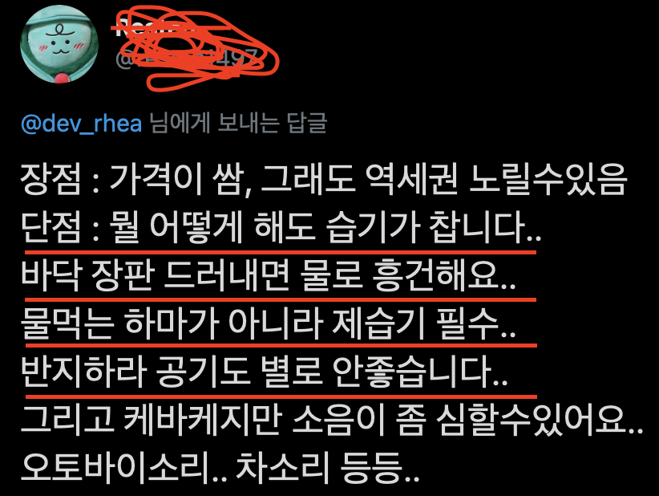

실제로 반지하에서 살고 계신 트친분이 알려주신 반지하 장단점..

강남, 신논현, 논현 등 반포동 쪽 매물은 깔끔하게 포기했습니다.

> 집이 아니라 창고가 나오는데, 창고가 월세 50이 넘어요. ㅋㅋ

### 둘째날

강남에서 점점 멀어지기 시작했습니다.

신천(현 잠실새내) 쪽이 좀 저렴한 매물들이 많다고 나와서 알아보기 시작했습니다.

옥탑도 나오고, 반지하도 나오고, 1층도 나오고 정말 다양했습니다.

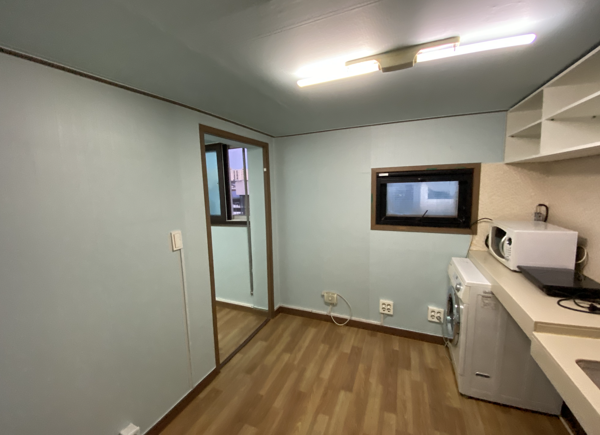

그 중 가장 충격적이었던 옥탑.

옥탑 방 올라가는게 정말 다이나믹한데다 (삐끗해서 넘어지면 바로 저세상. 추락..)  바로 앞에 사무실이 있고..  

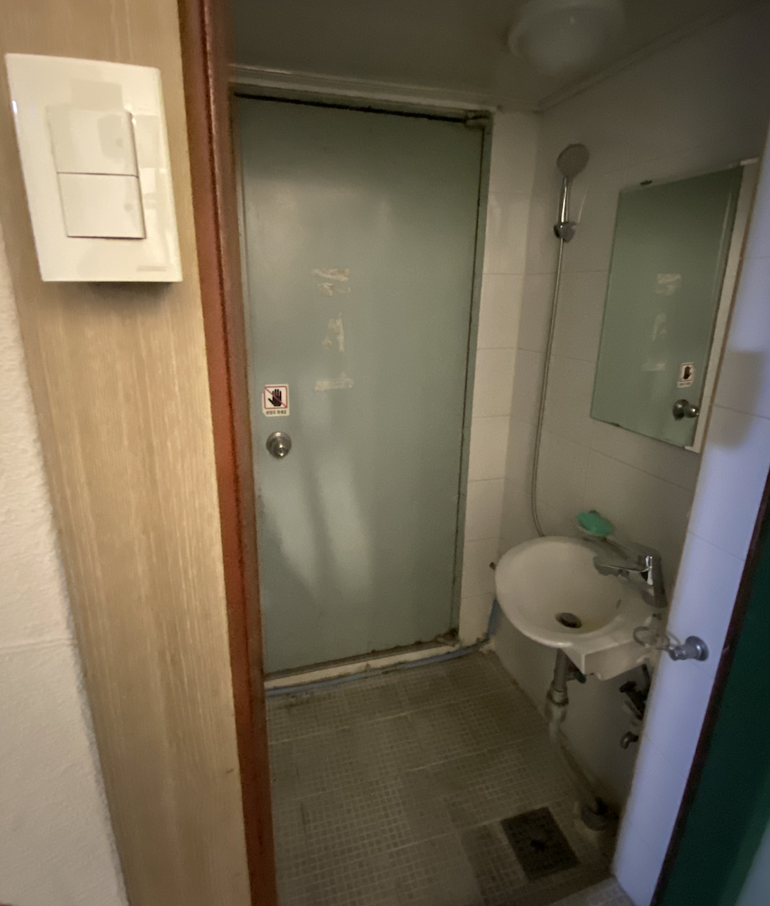

화장실이 방 밖에 따로 있습니다.. ㅋㅋㅋㅋㅋㅋㅋㅋㅋㅋㅋㅋ

사무실과 같이 씁니다 ㅋㅋ 샤워는 커녕 볼일도 보기 흉합니다 ㅋㅋㅋ..

위생이 정말..

그렇다고 집이 넓은 것도 아니고,  
창문을 열면 전선과 쇠파이프 등의 향연..  

방에서 이상한 냄새도 나고, 좀 전반적으로 낡았고...

그렇다고 월세가 저렴한 것도 아니고.. 이게 분명 35였나? 40이었나?

옥탑이니까 이렇다고 치고,

1층 ~ 3층 방을 보면 어찌.. 좀 상황이 달라질까요?

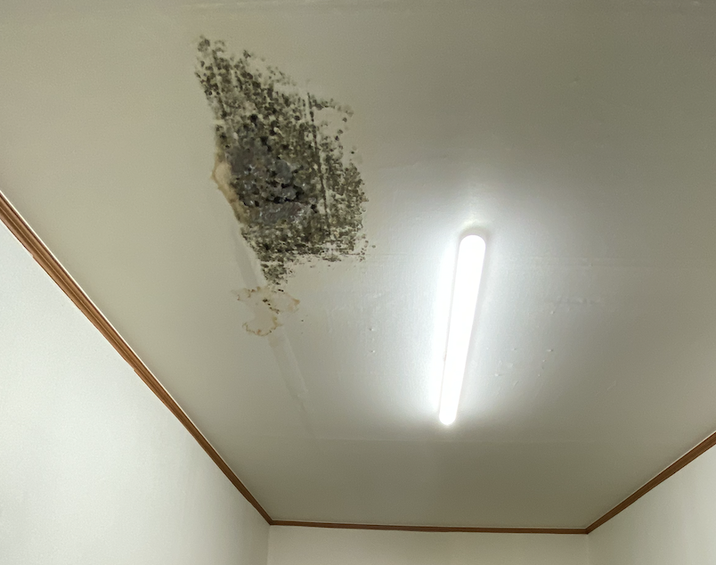

아뇨? 이 가격대에서는 여전히 곰팡이가 득실거리고, 오래된 방 밖에 찾아볼 수 없었습니다.

제일 놀랐던 건, 바로 옆에 주차장이어서 창문이 달려있어봤자 열지도 못하는 집도 있었다는 사실.. ㅋㅋㅋㅋㅋㅋㅋ

신천에 삼전이라고 하는 9호선 지하철 역이 생기면서부터, 전반적으로 10 ~ 20만원이 올랐다고 하더라구요.

그래도, 반포동보다는 나았습니다.

지상 매물이 있잖아요?

아 맞다 참. 집인 척하는 고시원도 있었어요.

> 잠실 쪽으로 가보았습니다만, 여전히 어림도 없었습니다.  
> 강남으로부터 더 멀어져야 할 필요가 있을 것 같습니다.
> 
> 강남으로부터 멀어지면 멀어질 수록 가격이 싸지는 **Magic**

### 셋째날

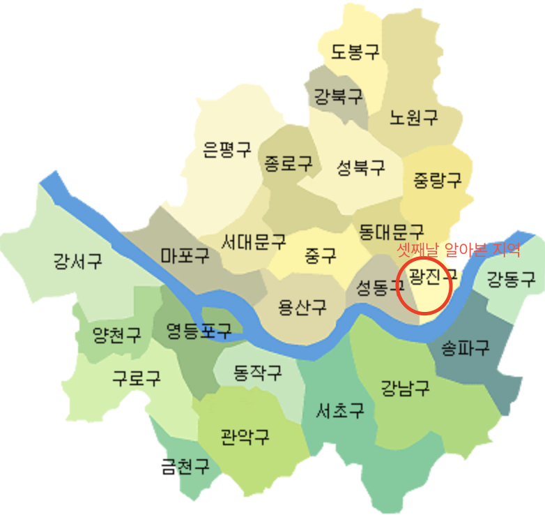

건대까지 올라왔습니다.

건대는 대학가니까, 다른 곳에 비해서 괜찮은 매물들이 많이 있지 않을까요?

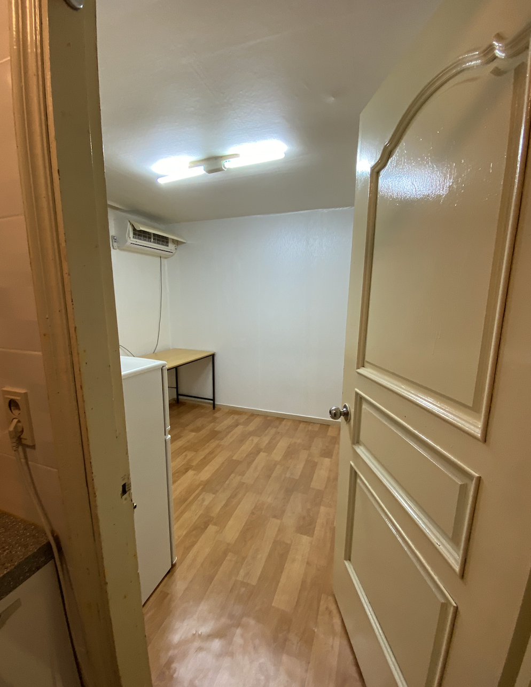

드디어 집이 나오긴 했습니다!!  
근데.. 어.. 근데 너무 낡았어요..

저 바닥 울퉁불퉁한거 보이시나요?

발을 스윽 가져다대니까 엄청 느껴지더라구요.. 바위 같은 것이..

집에서 등산하는 느낌을 내고 싶으신 분들께 강추!!!!

도배도 다시 해놓았던데(더덕더덕 붙혀서 가린 느낌), 다 곰팡이가 있기 때문에 한게 아닐까..? 라는 생각이 들더라구요

화장실에 깨진 바닥 타일 사이사이에서 물이 올라오질 않나...

에어컨도 오래된.. 필터 낡은거 보이고..

이 돈으로 이런 곳 밖에 못들어간다면,, 돈을 더 올렸을때 어떨까? 라는 생각이 들더라구요

1000/60 매물을 보여달라고 부탁드려서 가봤는데, 방이 완전 180도 달라지더라구요

다 새거인거 보세요

와.. 

드디어 깔끔하고 괜찮은 집이 나왔습니다.

서울에서 혼자 사려면 월세 1000/60은 기본인가 봅니다..?

+엘리베이터도 있고, 건물 입구에 보안 문도 있고..

어우 갑자기 슬퍼지기 시작했습니다.

> 대학 거리로 갔지만, 여전히 이 돈 가지고는 제대로 된 집을 볼 수 없었습니다.  
> 1000/60 이상부터 괜찮은 집들이 나오기 시작했는데, 혼자서 이 가격을 다 부담하기에는 너무 힘듭니다.  
> 
> 좋아요. 친구 한 명과 같이 살아본다면 어떨까요.

### 넷째날

셋째날과 동일하게 건대에서 매물을 찾기 시작했습니다.

대신, 조건이 변경되었습니다.

보증금이 1000만원까지, 월세가 85까지로 예산이 증가했습니다.

매물 7개 정도를 봤는데, 요약이 되더라구요

#### 낡았지만, 넓은 방

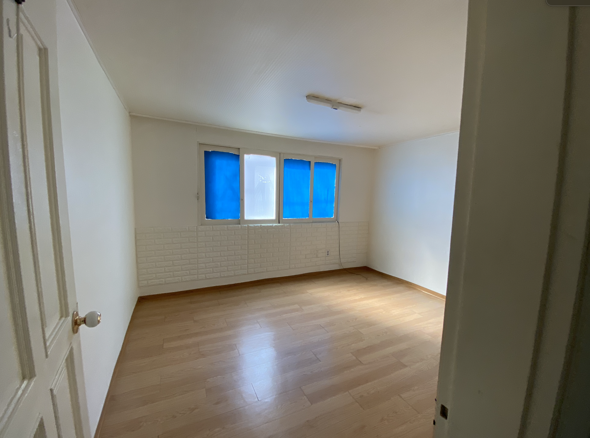
	드디어 햇빛이 들어옵니다 와!  
	역시 돈을 낼수록 좋아집니다!

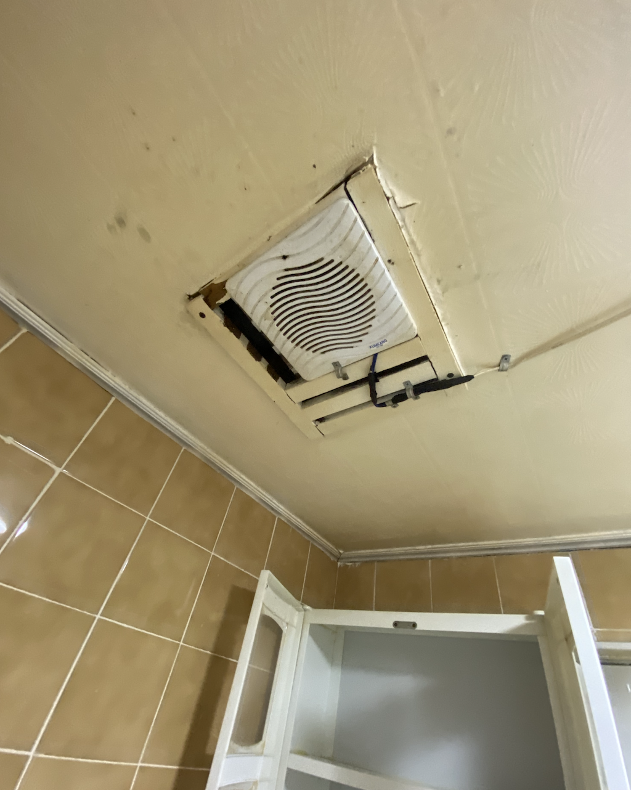
	하지만, 낡은 것은 어쩔수가 없나봅니다..!!

-----

#### 리모델링이 되어 있지만, 작은 방

세입자가 있어서 못찍었어요

되게 그랬어요. 뭐라 설명할지 모르겠네요.

-----

#### 비싼 방

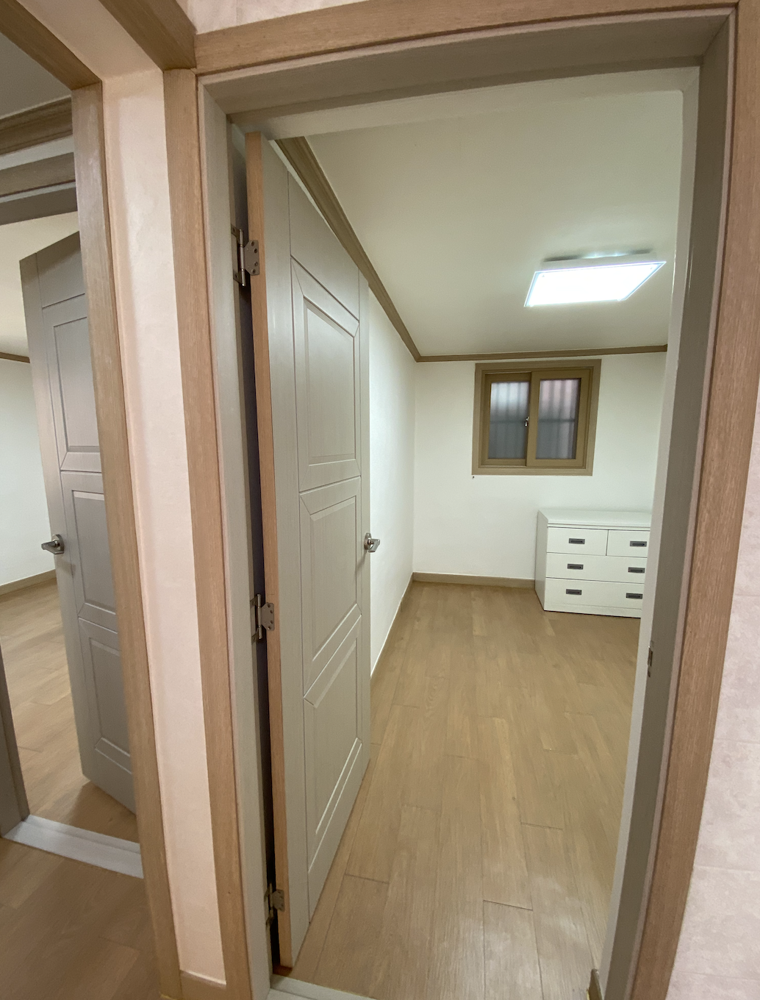
	월세 85에 관리비까지 추가로??  
	그래도, 방 컨디션은 크게 나쁘진 않았다..

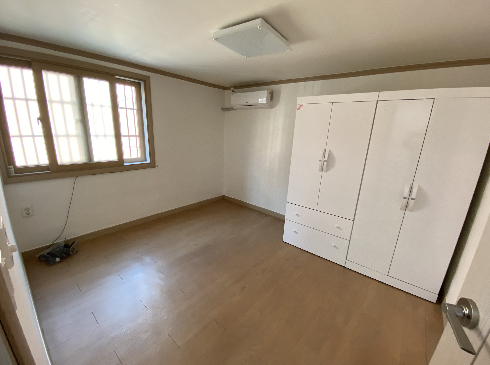
	근데 솔직히, 이 방에 이 가격..?  
	더 좋은게 있지 않을까..
	
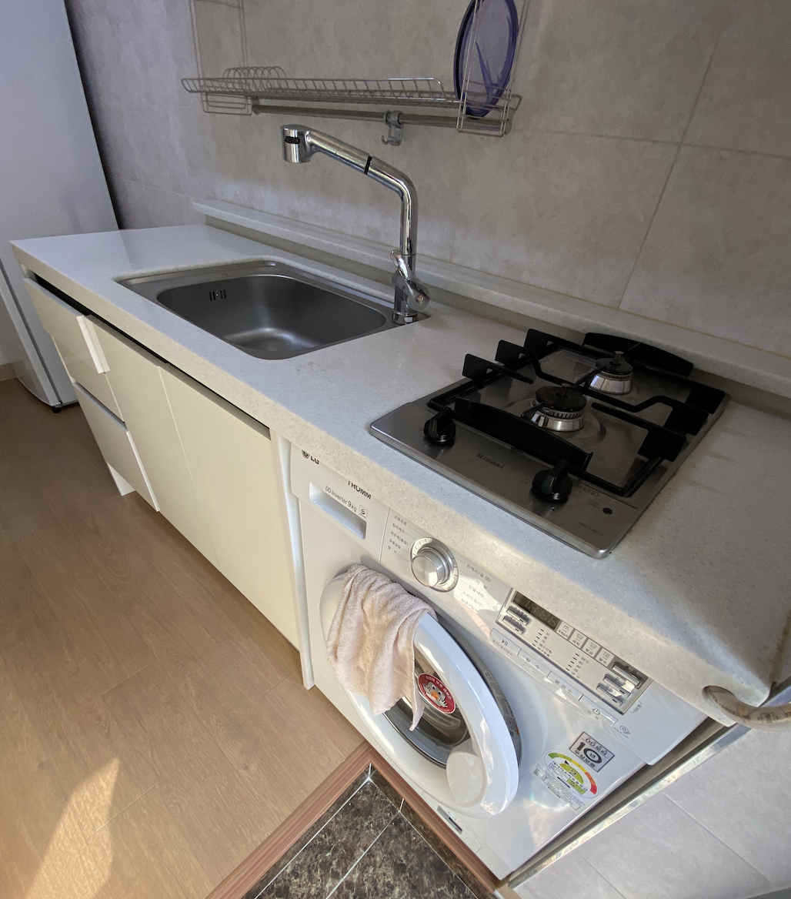
	풀옵션이긴 한데 좀.. 비싸다

-----

## 지금까지 요약

1. 300/50으로 반포, 잠실, 건대는 어림도 없었다
2. 혼자 살거면 1000/60은 있어야 한다
3. 1000/85로 올리니까 건대에 괜찮은 매물이 조금 있었다

## 최종적으로 이사를 다짐한 집

아무래도, 집토스 같은 공인중개사 어플은 정말 그 지역에 괜찮은 매물들을 알려주진 않나 보네요.

인터넷을 모르는 집주인일수록(할머니, 할아버지) 더더욱 안나오는 듯함.

위에서 1000/85 매물을 하기로 친구랑 마음을 정했는데,  
이게 정말 제일 좋은 매물인가? 싶어서 근처에 있는 아무 부동산에 처들어가서 물어보았어요.

그동안 겪었던 모든 이야기를 중개사분께 말씀드리고,  
좋은 방 있냐 물어보니까, 딱 하나 보여줄테니까 이거 보고 들어가라고..

이거 아니면 사실상 너네 그 마인드로는 평생 방 못 구한다고.. 하시더라구요?

밑져야 본전이니까 속는 셈치고 한번 따라가봤어요. 에이 좋아봤자 얼마나 좋겠어???

그렇게 따라간 집은 놀라웠습니다 ㄹㅇ.

1. 리모델링 새로 싹 다함
   1. 지금 입주하면, 리모델링 한 이후 첫 입주가 됨
2. 방에 창문이 태평양만하게 넓었음
3. 다 새거임!!!!
4. 화장실 겁나 김.. 넓은게 아니라 김
5. 환풍구 다 잘 갖추어져 있음
6. 바닥 마감, 벽 마감 나쁘지 않았음
7. 작은 방은 창문 마음껏 열어도 됨
   1. 바로 앞에 다른 건물 벽임. 집 창문이 아니라 눈치 안보임. 그렇다고 햇빛 안들어오는 것도 아님!!
8. 저녁에 그 집 가봤는데, 주변에 소음이 거의 없었음
   1. 좀 안쪽이라 그런가, 사람들이 많이 안다님
9. 집에서 소리 질러봤는데, 밖에서 아예 안들렸음
   1. 아니, 노래방이세요?
10. 건대입구역까지 천천히 걸어서 9분? 정도 걸림
11. 집 바로 뒤가 공원이라, 화나는 일 있을때 산책 가능
12. 방 넓음
13. 주변에 큰 코인 빨래방 있음
14. 인덕션 아님!!!! 가스레인지임!!!!!!!!
    1. 인덕션은 라면 끓여먹을때나 쓰라 이거야~
    2. 인덕션은 요리 절대 못함..
15. 1000/80 해주신단다!!!!!!

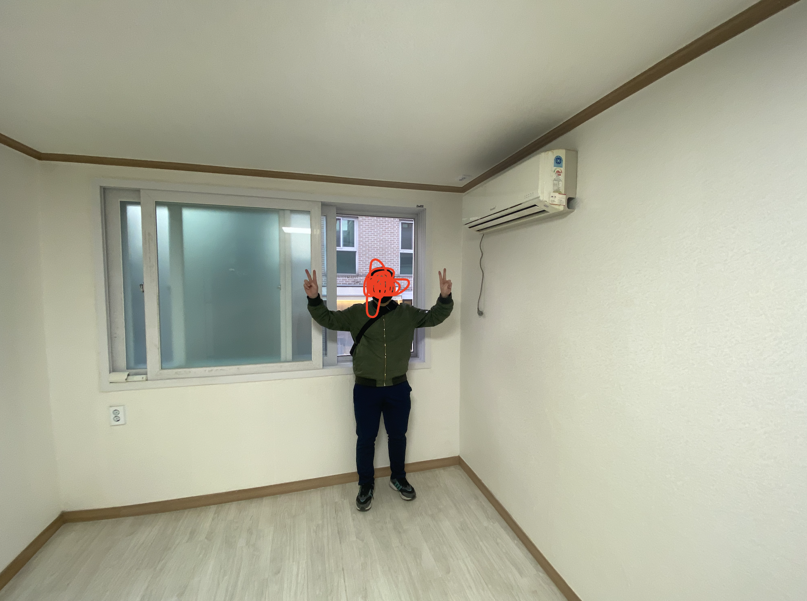

창문 ㅋㅋㅋㅋㅋ 넓은거봐라 ㅋㅋㅋㅋ 와 ㅋㅋㅋㅋㅋㅋ   
방도 넓은거 느껴지나요? ㅋㅋㅋ

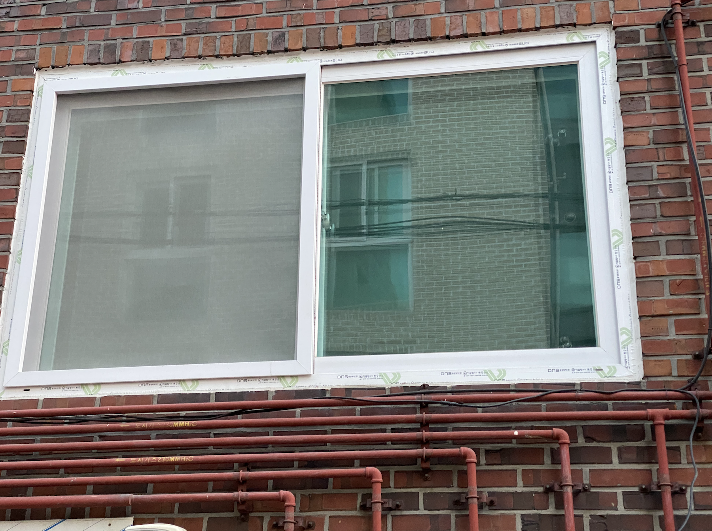

뭔 ㅋㅋㅋ 밖에서 봐도 뭔 ㅋㅋㅋ 창문 크기가 진짜 미쳤음

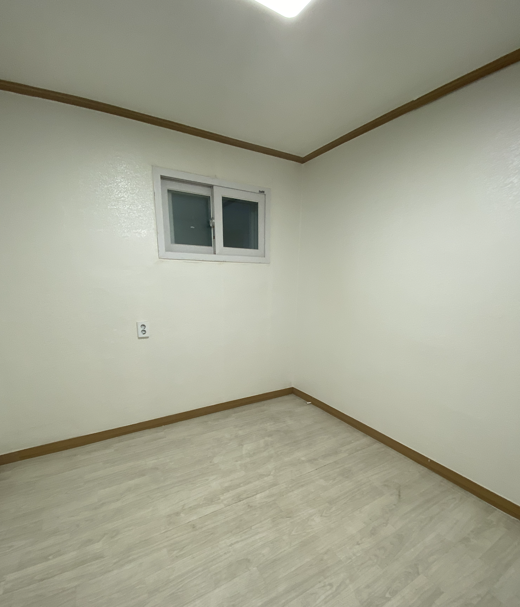

작은 방도 그동안 봤던 집들 중에서 제일 넓었던 것 같음.

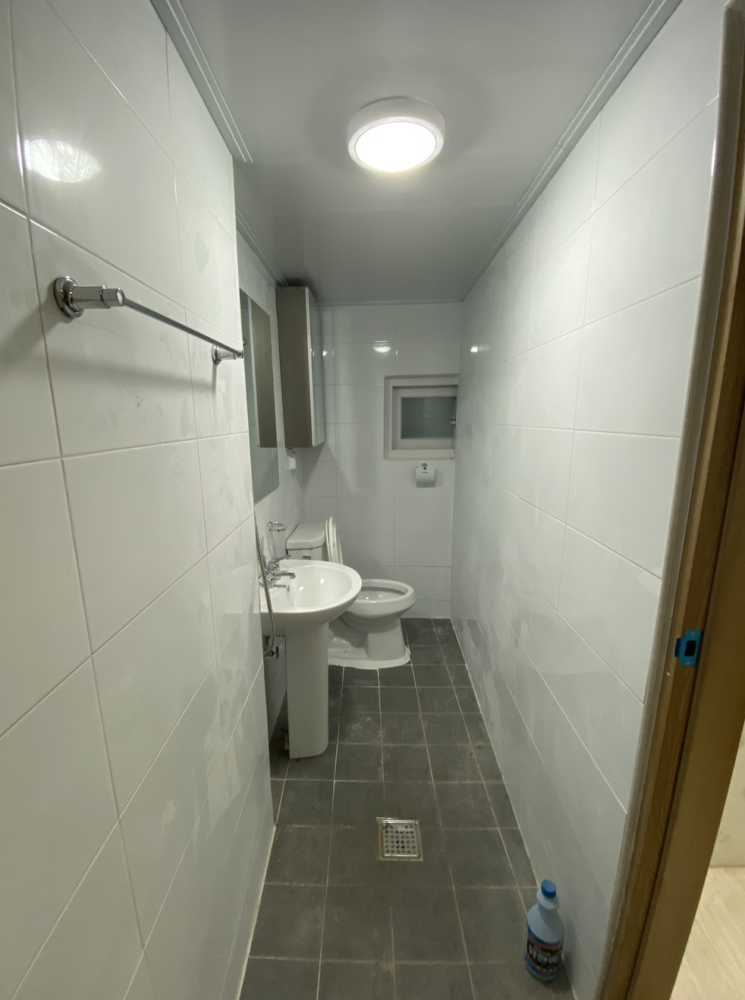

화장실 길어요 ㅋㅋㅋ
근데 생각해보면 이런 배치가 오히려 수건 젖을 일도 없고, 오히려 더 괜찮은 것 같아요

사진으로는 못 담았는데, 여기가 2층이고, 2층에 다른 가구는 없어요.

한 층 다 씀 엌ㅋㅋㅋ

집 들어갈때 눈치 안보임, 옆 방 소음도 없음. 오로지 위층 아래층만.

진짜 내가 들어갈 집은 문을 열자마자 안다더니, 이 집이 딱 그랬음..

이거 방 보자마자 바로 부모님께 연락돌리고 가계약 했습니다.

## 결론

1. 남자 두 명이서 건대 입구 역 근처에 1000/80 집을 찾았다
2. 인테리어 새로 했고, 방도 넓다
3. 집토스 등 어플만으로 집을 알아보는건 한계가 명확했다
   1. 꼭 그 지역 공인중개사를 통해서 매물을 더 알아볼 것
4. 서울에서 혼자 살려면 1000/60이 시작이었다
5. 고시원은 지옥이다

## 이사 전에 꼭 확인해야 하는 것들

이사를 하기 전에 사전에 먼저 확인해야하는 것들은 예상 외로 많았다.

~~이것도 해야하고, 저것도 해야하고, 아차 이것도 해야했지 참 ... 등등~~

### 출퇴근 시간, 환경

꼭 사전에 먼저 타임워치로 시간 재둘 것  
1시간을 넘어가는 순간부터 많이 피곤해지니까 참고할 것

### 주변 인프라

주 거래 은행, 마트는 필수  
음식점이나 기타 편의시설있으면 있을수록 더 좋다

건대가 이런거 다 있어서 괜찮더라

### 가스, 전기, 수도, 인터넷

꼭 이전 세입자가 다 내고 나갔는지 확인할 것  
인터넷은 일주일 전에 신청 할 것

### 가스 신청법

**명의변경 신청하기**  
 1. 이사로 인해 가스사용자가 변경되는 경우 명의변경을 하시는 것이 좋습니다.
 2. 명의변경 신청은 각 지역 도시가스 회사 고객센터에 문서(전자문서 포함함) 또는 전화로 할 수 있습니다.
 3. 전 가스사용자의 미납금액이 있는 경우 명의변경이 되지 않으므로 명의변경을 신청하는 경우 계량기와 미납금액을 확인하시기 바랍니다.
 4. 명의변경을 신청하지 않으면 전 가스사용자의 권리와 의무를 승계한 것이 되어 전 가스사용자의 미납요금을 납부해야 할 경우도 있습니다.

[https://www.seoulgas.co.kr/front/customer/faqList.do#none](https://www.seoulgas.co.kr/front/customer/faqList.do#none)

[https://m.blog.naver.com/mimoa88/221854712178](https://m.blog.naver.com/mimoa88/221854712178)

꼭 최소 3일 전에 연락해서, 가스 연결해두기!!

### 전기 신청법

 1. 요금 정산, 납부하기
    1. 이사 당일 전력사용지침(계량기 현재 지침)을 한전 사이버지점, 고객센터(☎ 국번없이 123) 또는 관할 한전지점에 전화로 신고한 후, 희망하는 방법(신용카드 납부 또는 납부자가 지정하는 계좌에서 출금)으로 전기요금을 납부하시면 됩니다.
 2. 명의변경 신청하기
    1. 이사로 인해 전기사용자가 변경되는 경우 전출자와 전입자는 그 변경내용을 변경발생 후 14일 이내에 한국전력공사에 통지해야 합니다[「전기공급약관」 (한국전력공사약관, 2020. 6. 2. 시행) 제12조제1항].
    2. 전출자(1주택 수가구 및 종합계약아파트 거주자인 전출자은 신청불가)는 다음의 방법 중 어느 하나를 선택하여 명의변경을 신청하시면 됩니다.
    3. 한국전력공사 사이버지점에 접속하여 인터넷 신청하기
    4. 한국전력공사 고객센터(☎ 국번없이 123)로 전화신청하기
    5. 한국전력공사 지점으로 방문하거나 전화신청하기
    6. ※ 계약전력이 6KW 이상(일반적인 가정용 전력은 대부분 5KW 이하임)경우 전기사용명의변경 신청방법과 구비서류에 관한 자세한 내용은 < 한전 사이버지점 ( http://cyber.kepco.co.kr )-신청·접수-업무찾기-명의 변경 > 부분에서 확인하실 수 있습니다.
    7. 이사로 인해 전입자가 명의변경에 따른 사용자별 요금 구분청구를 신청할 경우에는 전기요금은 사용자 변경일을 기준으로 전출자, 전입자별로 각각 계산하여 청구됩니다(「전기공급약관」 제12조제3항 본문).
    8. 다만, 변경일 이후에 사용자별 요금 구분청구를 신청할 경우에는 미납요금에 한하여 변경일이 속한 해당 월의 사용전력량을 전출자, 전입자와 협의하여 결정하고 이에 따라 요금은 각각 계산하여 청구됩니다(「전기공급약관」 제12조제3항 단서).

### 수도 신청법

생략

### 인터넷 신청법

가까운 대리점가서 의뢰하면 다 됨

대칭형과 비대칭형 차이를 꼭 알아둘 것  
1. [https://www.100mb.kr/bbs/board.php?bo_table=information&wr_id=11162](https://www.100mb.kr/bbs/board.php?bo_table=information&wr_id=11162)
2. [https://coolenjoy.net/bbs/37/212973?page=17](https://coolenjoy.net/bbs/37/212973?page=17)

대칭형으로 꼭 설치하자

### 건물 대출 여부

있으면.. 눈치껏..

### 참고

공실 공과금

[https://www.ppomppu.co.kr/zboard/view.php?id=house&no=58663](https://www.ppomppu.co.kr/zboard/view.php?id=house&no=58663)

[https://m.blog.naver.com/babypanda1228/221775347157](https://m.blog.naver.com/babypanda1228/221775347157)

[https://m.blog.naver.com/PostView.nhn?blogId=new2222a&logNo=221562854927&proxyReferer=https:%2F%2Fwww.google.com%2F](https://m.blog.naver.com/PostView.nhn?blogId=new2222a&logNo=221562854927&proxyReferer=https:%2F%2Fwww.google.com%2F)

## 이사 후 생활

새로운 글로 다시 뵙겠습니다.